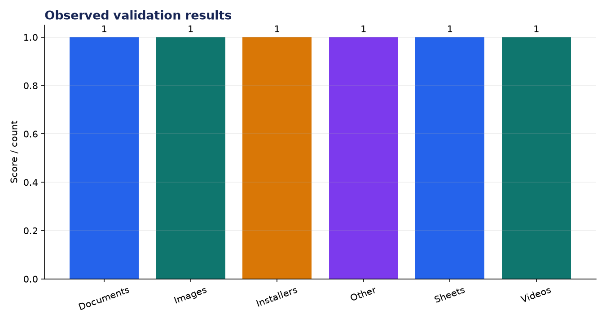
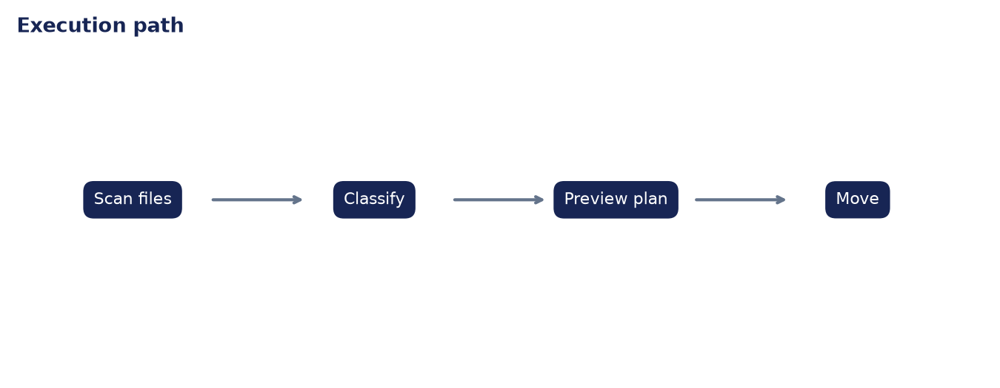

# Technical Evaluation: File Organizer Agent (Desktop AI)

**Author:** Edward Ocran  
**Project:** 56  
**Validation status:** Passed

## Executive finding

A six-file fixture was classified into six distinct destinations and then tested in real move mode. Every source file arrived in its planned category: document, image, installer, spreadsheet, video, and unmatched binary.



## What the run shows

The even distribution is intentional test coverage rather than a claim about desktop composition. It confirms that each extension rule is exercised and that the preview plan matches the executed move. The preview-first design is the key operational control because users can inspect destinations before any file changes occur.



## Method

The project was run through its normal workflow and its returned metrics were checked against the included automated test. The chart above reports the observed demonstration values; it is not a benchmark against unrelated systems. The second figure documents the control flow so the result can be reproduced and audited from the code.

## Interpretation and next decision

Classification is extension-led except for PDFs, where text cues can identify résumés. Duplicate names, recursive folders, rollback, and ambiguous files need explicit policies before using the organizer on a large personal directory.

## Reproduce the analysis

```powershell
python main.py
python -m unittest -v test_project.py
```

The implementation and test output are the primary evidence. External source details, where used, are documented in `INPUTS.md`.
