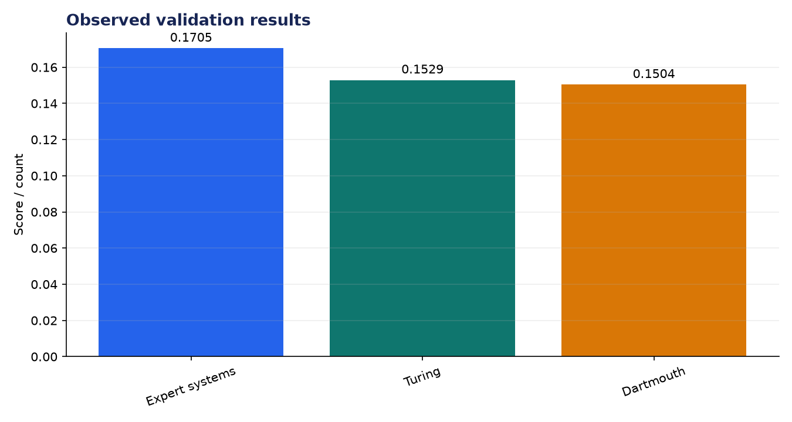
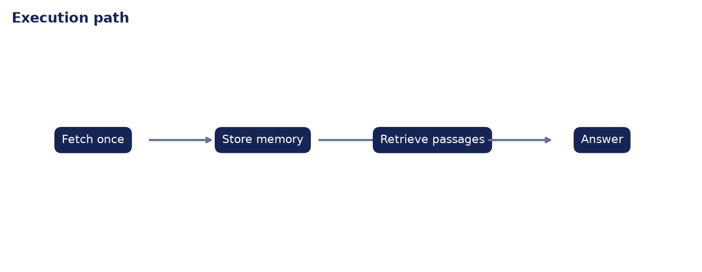

# Analysis Report: Browser Agent with Memory

**Author:** Edward Ocran  
**Project:** 57  
**Validation status:** Passed

## Executive finding

The agent fetched the Artificial intelligence article once, stored 151 boundary-safe chunks, and retrieved three historically relevant passages. Similarity scores ranged from 0.1504 to 0.1705, covering the Dartmouth workshop, Turing's test, and the expert-system cycle.



## What the run shows

The evidence spans three different phases instead of repeating one paragraph. That diversity makes the answer more useful: it links the field's formal founding, an early evaluation idea, and a later commercial boom followed by another winter. Memory also prevents a second network read when the user changes the wording of the question.



## Method

The project was run through its normal workflow and its returned metrics were checked against the included automated test. The chart above reports the observed demonstration values; it is not a benchmark against unrelated systems. The second figure documents the control flow so the result can be reproduced and audited from the code.

## Interpretation and next decision

TF–IDF is lexical, so related passages without shared terms may rank poorly. Dense embeddings, citation-level identifiers, and a synthesis step that orders evidence chronologically would improve answer quality.

## Reproduce the analysis

```powershell
python main.py
python -m unittest -v test_project.py
```

The implementation and test output are the primary evidence. External source details, where used, are documented in `DATASET.md`.
