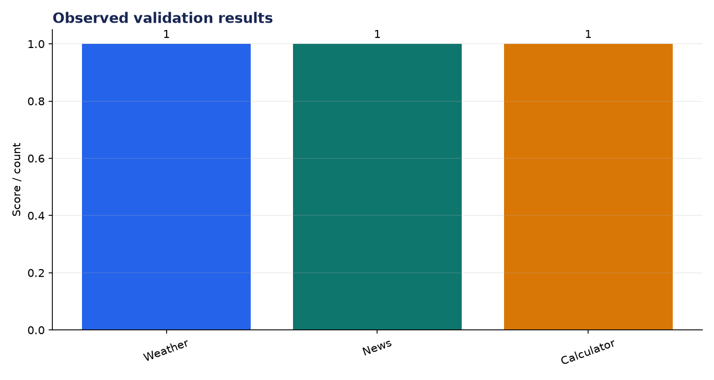
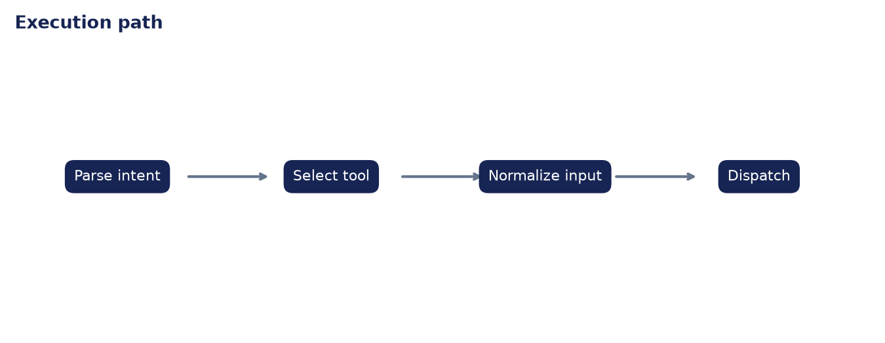

# Analysis Report: API Router with LLM

**Author:** Edward Ocran  
**Project:** 58  
**Validation status:** Passed

## Executive finding

Three natural-language requests were routed to three different tools with 100% accuracy in the demonstration: weather, news, and arithmetic. Each route records the selected function and normalized input before dispatch.



## What the run shows

The test set confirms clean separation between intent selection and tool execution. That separation matters because a bad route can be diagnosed independently from a failing API. The calculator path also inherits the restricted arithmetic evaluator instead of sending expressions to unrestricted Python.



## Method

The project was run through its normal workflow and its returned metrics were checked against the included automated test. The chart above reports the observed demonstration values; it is not a benchmark against unrelated systems. The second figure documents the control flow so the result can be reproduced and audited from the code.

## Interpretation and next decision

Routing currently relies on transparent rules and the weather/news tools return deterministic fixtures. External APIs would require schema validation, credentials, retry logic, and an explicit fallback when intent confidence is low.

## Reproduce the analysis

```powershell
python main.py
python -m unittest -v test_project.py
```

The implementation and test output are the primary evidence. External source details, where used, are documented in `DATASET.md`.
