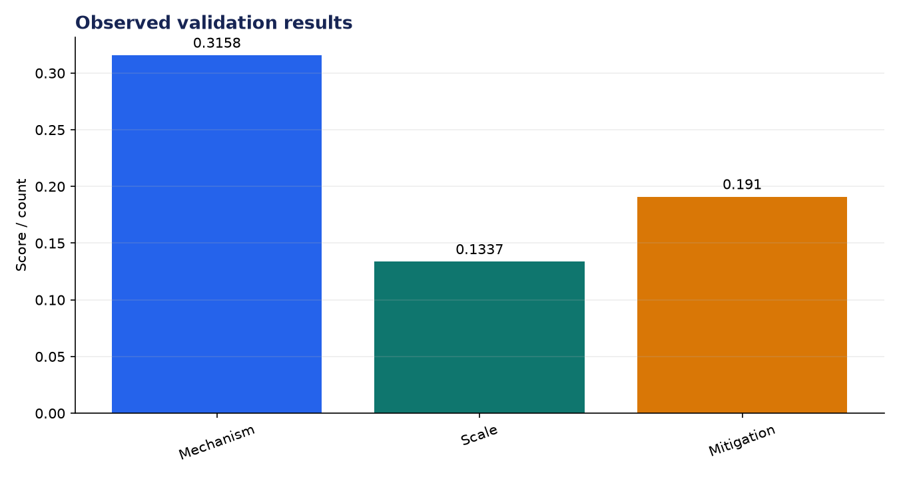
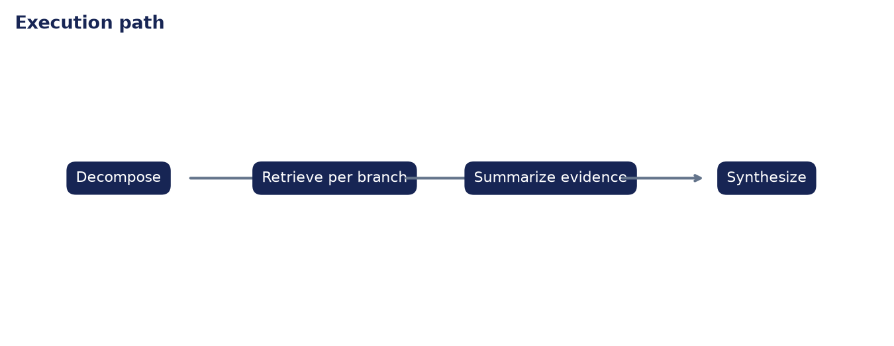

# Technical Evaluation: Recursive Research Agent

**Author:** Edward Ocran  
**Project:** 59  
**Validation status:** Passed

## Executive finding

The agent decomposed the environmental-impact question into mechanism, scale, and mitigation branches. It indexed 49 complete text chunks and returned evidence for all three, with retrieval similarity between 0.1337 and 0.3158.



## What the run shows

The mechanism evidence is strongest and directly links mining to energy use, emissions, and electronic waste. The scale branch adds a concrete estimate—2,300 tonnes of e-waste with 87% recycled, sold, or repurposed in the cited CCAF account—while the mitigation branch identifies waste-heat reuse in greenhouses. Together, the branches avoid reducing the issue to electricity consumption alone.



## Method

The project was run through its normal workflow and its returned metrics were checked against the included automated test. The chart above reports the observed demonstration values; it is not a benchmark against unrelated systems. The second figure documents the control flow so the result can be reproduced and audited from the code.

## Interpretation and next decision

The source is a single synthesis page and its claims inherit that page's citations and disagreements. A deeper investigation should retrieve the underlying studies, compare estimation methods, and retain source-level citations in every answer.

## Reproduce the analysis

```powershell
python main.py
python -m unittest -v test_project.py
```

The implementation and test output are the primary evidence. External source details, where used, are documented in `INPUTS.md`.
