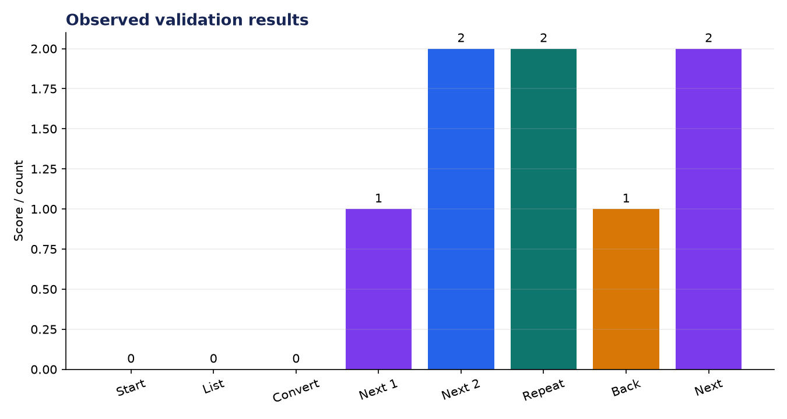
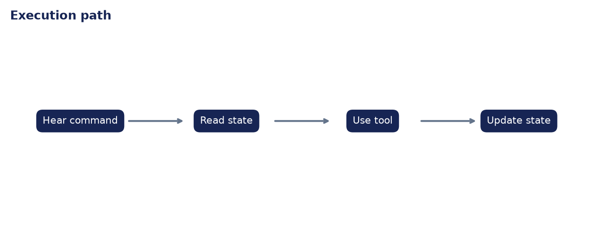

# Analysis Report: Cooking Assistant (Voice + Tools)

**Author:** Edward Ocran  
**Project:** 60  
**Validation status:** Passed

## Executive finding

Eight conversational commands exercised recipe start, ingredient listing, unit conversion, step advance, repeat, and back navigation. The assistant completed two forward steps, correctly replayed the previous instruction, moved back one step, and recovered to step two.



## What the run shows

The state trace demonstrates that navigation commands change state differently: repeat is read-only, back decrements safely, and next advances exactly once. Conversion is likewise independent of progress, so a user can request metric quantities without losing their place.



## Method

The project was run through its normal workflow and its returned metrics were checked against the included automated test. The chart above reports the observed demonstration values; it is not a benchmark against unrelated systems. The second figure documents the control flow so the result can be reproduced and audited from the code.

## Interpretation and next decision

The interface is text-based and uses a fixed pancake recipe. Speech recognition, timers, dietary substitutions, persistence across sessions, and confirmation for ambiguous commands are logical production extensions.

## Reproduce the analysis

```powershell
python main.py
python -m unittest -v test_project.py
```

The implementation and test output are the primary evidence. External source details, where used, are documented in `DATASET.md`.
