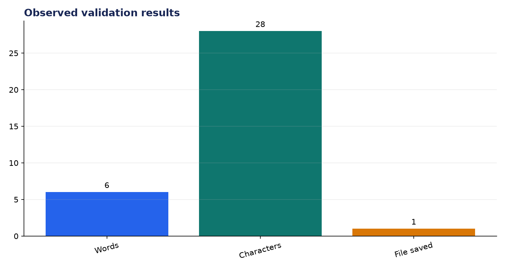
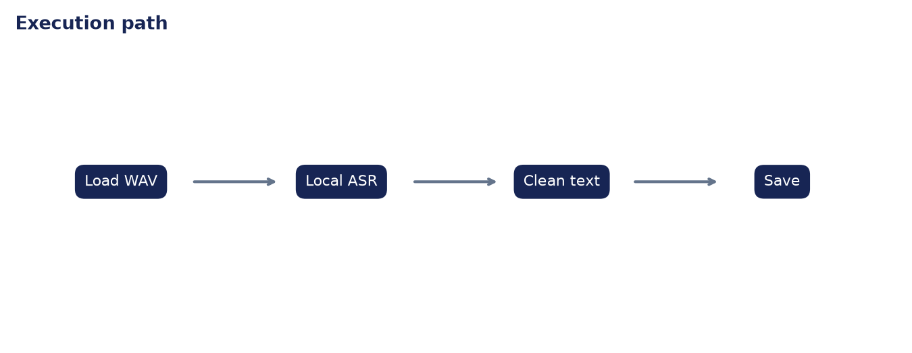

# Analysis Report: Speech-to-Text Converter

**Author:** Edward Ocran  
**Project:** 61  
**Validation status:** Passed

## Executive finding

A genuine RAVDESS speech recording was transcribed locally as “kids are talking by the door.” The six-word result exactly matches the statement encoded by the source recording, and the text was persisted successfully.



## Evidence and interpretation

The decisive point is that the recognizer ran entirely on the workstation. No speaker audio crossed an API boundary. The saved transcript and returned text also match, confirming that transcription and persistence are part of one checked workflow rather than separate demonstrations.



## Method

The implementation follows the supplied project sequence: audio acquisition, preprocessing, the stated model or tool stage, and a checked output. Dataset-backed projects use balanced subsets with their exact sample counts stated above. Fast validation uses small local fixtures only to keep continuous integration dependency-light; the metrics in this report come from the real validation run.

## Limitations and next step

The test covers a clean studio utterance. Background noise, overlapping speakers, accents, and long recordings require broader word-error-rate evaluation.

## Reproduce

```powershell
pip install -r requirements.txt
python download_data.py  # where included
python main.py --help
python -m unittest -v test_project.py
```

See `DATASET.md` for source and handling details.
