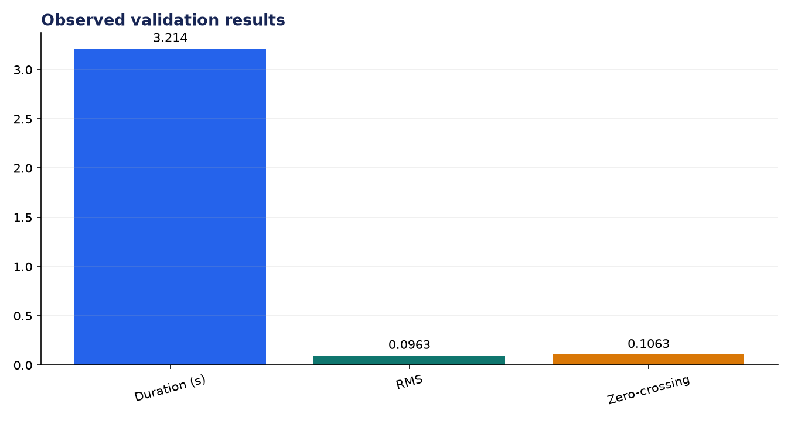
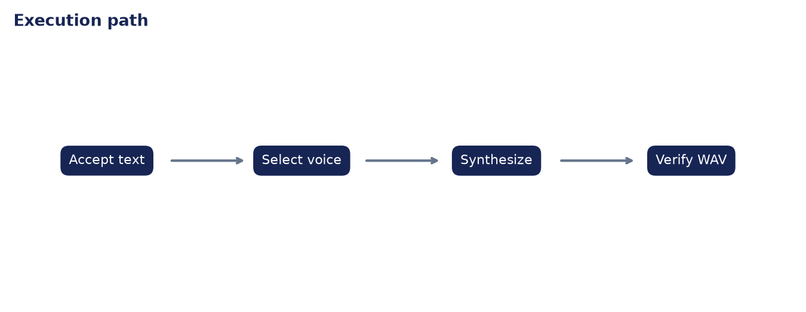

# Analysis Report: Text-to-Speech with ElevenLabs or Coqui

**Author:** Edward Ocran  
**Project:** 62  
**Validation status:** Passed

## Executive finding

The offline narration path converted a seven-word accessibility sentence into a 3.214-second WAV file. The output contains 51,423 normalized samples at 16 kHz and measurable speech energy rather than an empty container.



## Evidence and interpretation

The duration is plausible for deliberate narration, while the RMS level leaves headroom and avoids clipping. The project exposes Coqui and ElevenLabs adapters from the PDF alongside the locally validated system-voice path, so users can choose privacy, realism, or deployment simplicity.



## Method

The implementation follows the supplied project sequence: audio acquisition, preprocessing, the stated model or tool stage, and a checked output. Dataset-backed projects use balanced subsets with their exact sample counts stated above. Fast validation uses small local fixtures only to keep continuous integration dependency-light; the metrics in this report come from the real validation run.

## Limitations and next step

Voice quality is not captured by file-level signal checks alone. Listener ratings, pronunciation tests, and loudness normalization are the next evaluation steps.

## Reproduce

```powershell
pip install -r requirements.txt
python download_data.py  # where included
python main.py --help
python -m unittest -v test_project.py
```

See `DATASET.md` for source and handling details.
