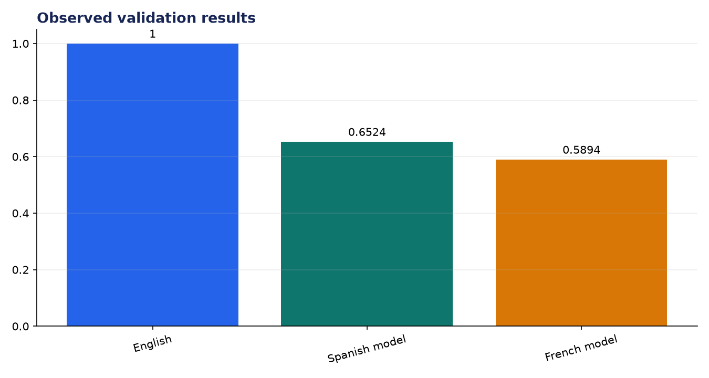
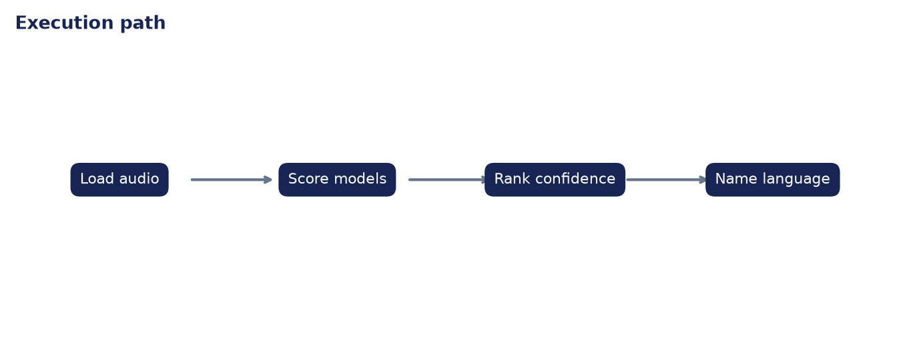

# Analysis Report: Language Identification from Audio

**Author:** Edward Ocran  
**Project:** 63  
**Validation status:** Passed

## Executive finding

Three offline language recognizers scored the same RAVDESS clip. English ranked first with 1.000 mean word confidence and produced the correct sentence; Spanish and French produced lower-confidence phonetic approximations.



## Evidence and interpretation

The margin matters more than the winning label. English led Spanish by 0.3476 and French by 0.4106, leaving a clear decision rather than a near-tie. Because each model sees the same waveform, the comparison is attributable to language fit rather than different preprocessing.



## Method

The implementation follows the supplied project sequence: audio acquisition, preprocessing, the stated model or tool stage, and a checked output. Dataset-backed projects use balanced subsets with their exact sample counts stated above. Fast validation uses small local fixtures only to keep continuous integration dependency-light; the metrics in this report come from the real validation run.

## Limitations and next step

Confidence values from different acoustic models are not perfectly calibrated. A multilingual benchmark should be used to set an abstention threshold and measure per-language recall.

## Reproduce

```powershell
pip install -r requirements.txt
python download_data.py  # where included
python main.py --help
python -m unittest -v test_project.py
```

See `DATASET.md` for source and handling details.
