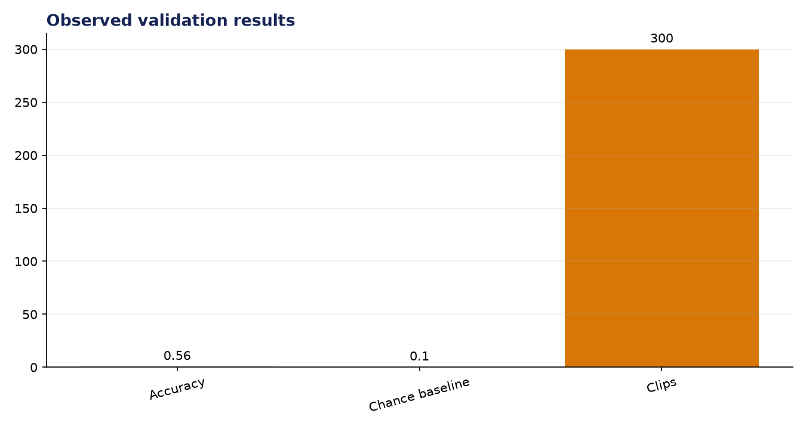
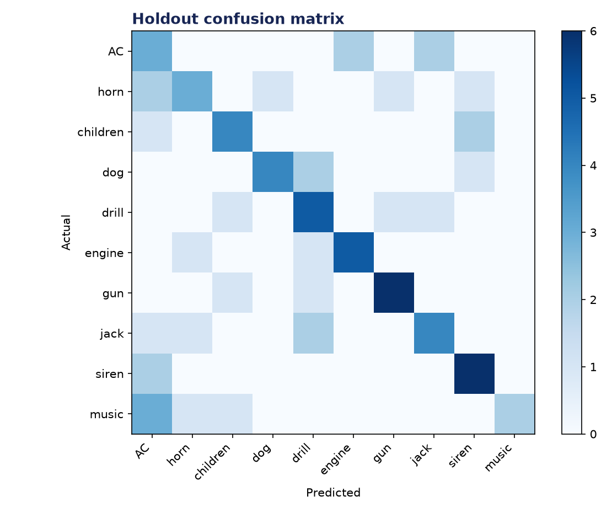

# Analysis Report: Sound Classification (UrbanSound8K)

**Author:** Edward Ocran  
**Project:** 64  
**Validation status:** Passed

## Executive finding

A balanced 300-clip UrbanSound8K subset covering all ten official classes produced 56.0% holdout accuracy. That is 5.6 times the 10% random baseline using a compact Random Forest and inspectable time-frequency features.



## Evidence and interpretation

Performance is uneven. Gun shots and sirens were recognized more reliably than street music, while stationary mechanical sounds sometimes overlapped acoustically. The confusion pattern supports the course premise that spectral structure is useful, but it also shows why a larger CNN and fold-respecting evaluation are warranted.



## Method

The implementation follows the supplied project sequence: audio acquisition, preprocessing, the stated model or tool stage, and a checked output. Dataset-backed projects use balanced subsets with their exact sample counts stated above. Fast validation uses small local fixtures only to keep continuous integration dependency-light; the metrics in this report come from the real validation run.

## Limitations and next step

The subset is balanced but smaller than the full 8,732-file dataset, and the random split does not reproduce the official ten-fold protocol. The next benchmark should train on nine folds and test on the held-out fold.

## Reproduce

```powershell
pip install -r requirements.txt
python download_data.py  # where included
python main.py --help
python -m unittest -v test_project.py
```

See `DATASET.md` for source and handling details.
