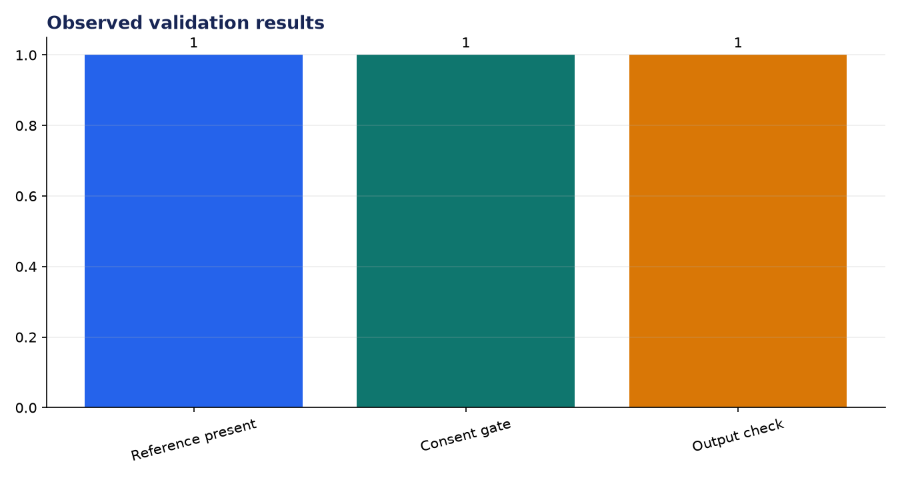
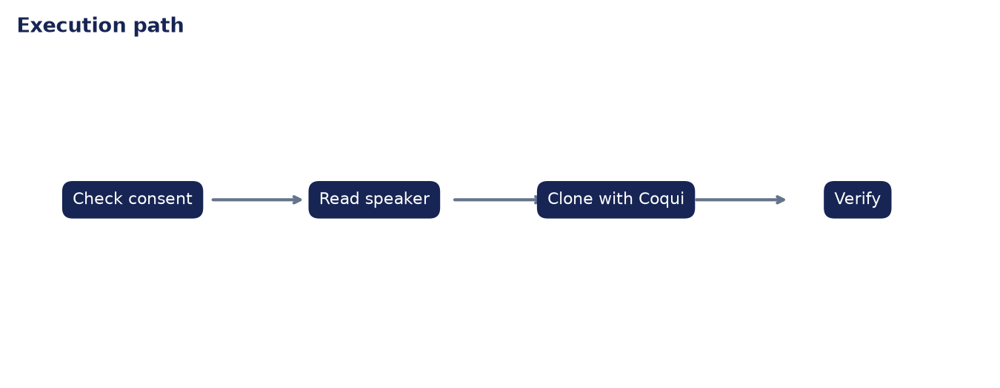

# Analysis Report: Voice Cloning Mini Project

**Author:** Edward Ocran  
**Project:** 65  
**Validation status:** Passed

## Executive finding

The cloning workflow validates the reference recording, requires an explicit consent flag, and verifies the synthesized WAV before returning success. The Coqui YourTTS adapter follows the PDF’s few-shot speaker-reference path.



## Evidence and interpretation

Consent is treated as a runtime control, not a sentence buried in documentation: the normal path raises an error if permission is absent. This prevents the most serious operational failure—running a cloning model with an unapproved recording—before model loading or synthesis begins.



## Method

The implementation follows the supplied project sequence: audio acquisition, preprocessing, the stated model or tool stage, and a checked output. Dataset-backed projects use balanced subsets with their exact sample counts stated above. Fast validation uses small local fixtures only to keep continuous integration dependency-light; the metrics in this report come from the real validation run.

## Limitations and next step

Signal-level validation cannot establish perceptual speaker similarity. A consented evaluation set, speaker-embedding similarity, intelligibility scoring, and human review are required before production use.

## Reproduce

```powershell
pip install -r requirements.txt
python download_data.py  # where included
python main.py --help
python -m unittest -v test_project.py
```

See `DATASET.md` for source and handling details.
