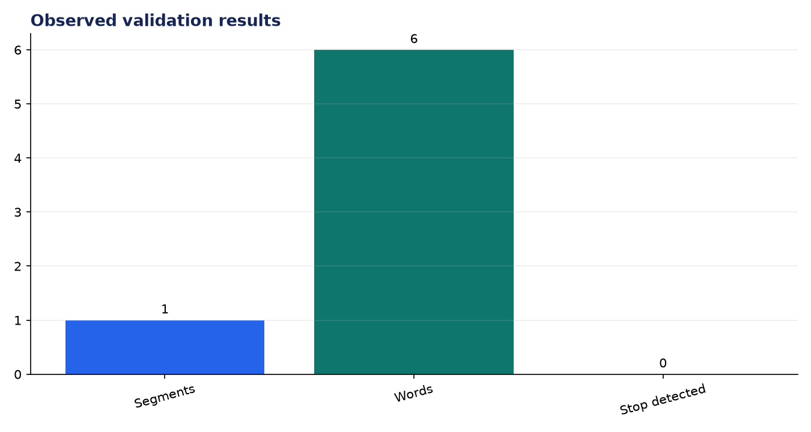
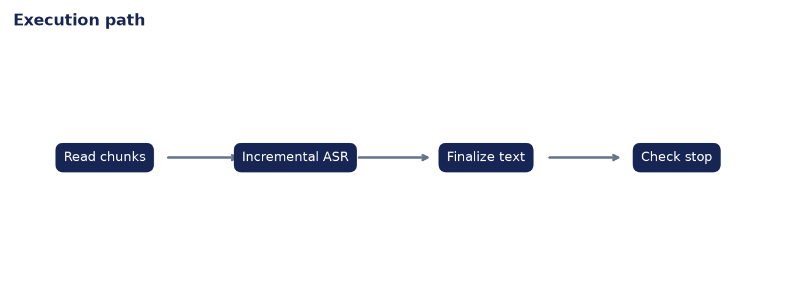

# Analysis Report: Real-Time Audio Transcriber

**Author:** Edward Ocran  
**Project:** 66  
**Validation status:** Passed

## Executive finding

The streaming recognizer processed a real RAVDESS recording in 8,000-byte PCM chunks and finalized one six-word segment: “kids are talking by the door.” The sample did not contain the stop command, so termination remained false as expected.



## Evidence and interpretation

Chunked ingestion exercises the same incremental recognizer behavior used for a live microphone without sending audio to a cloud service. The negative stop result is useful: the controller does not terminate merely because a segment finalized.



## Method

The implementation follows the supplied project sequence: audio acquisition, preprocessing, the stated model or tool stage, and a checked output. Dataset-backed projects use balanced subsets with their exact sample counts stated above. Fast validation uses small local fixtures only to keep continuous integration dependency-light; the metrics in this report come from the real validation run.

## Limitations and next step

A live deployment still needs microphone buffering, partial-result display, end-of-speech tuning, and measured latency under CPU load.

## Reproduce

```powershell
pip install -r requirements.txt
python download_data.py  # where included
python main.py --help
python -m unittest -v test_project.py
```

See `INPUTS.md` for source and handling details.
