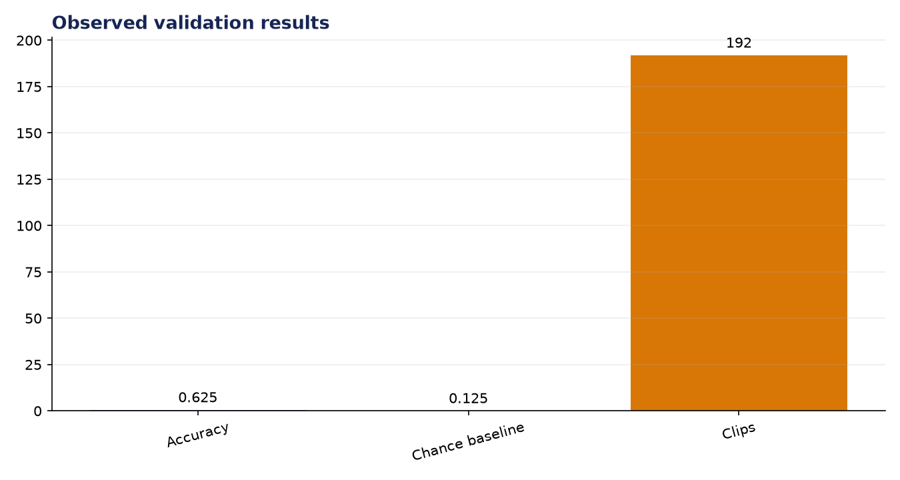
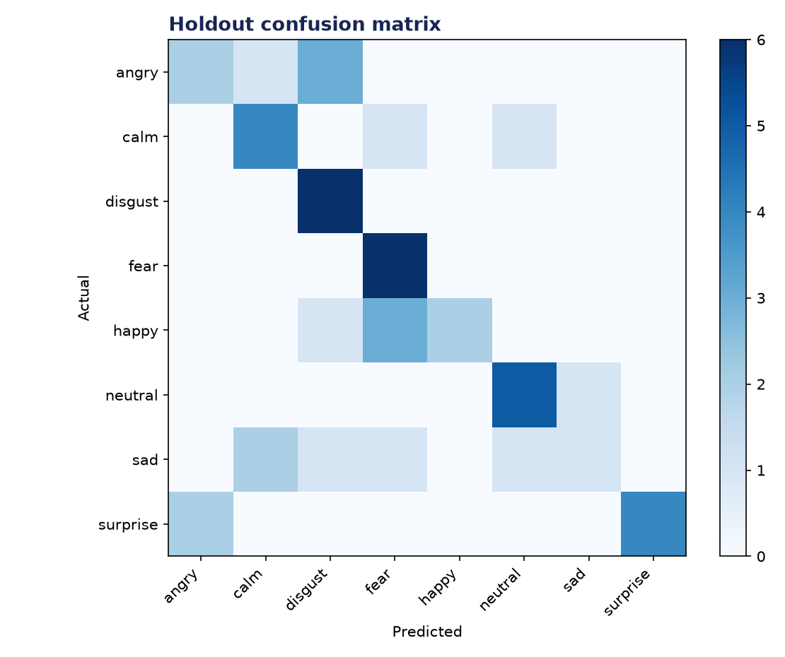

# Analysis Report: Voice Emotion Classifier

**Author:** Edward Ocran  
**Project:** 67  
**Validation status:** Passed

## Executive finding

The RAVDESS experiment used 192 real recordings, balanced at 24 clips across eight emotions. Holdout accuracy reached 62.5%, five times the 12.5% chance baseline.



## Evidence and interpretation

Neutral, disgust, and fearful speech were the cleanest classes in this sample; sad and happy expressions were more frequently confused with neighboring affective patterns. This is consistent with a model that captures intensity and timbre but has limited speaker and temporal context.



## Method

The implementation follows the supplied project sequence: audio acquisition, preprocessing, the stated model or tool stage, and a checked output. Dataset-backed projects use balanced subsets with their exact sample counts stated above. Fast validation uses small local fixtures only to keep continuous integration dependency-light; the metrics in this report come from the real validation run.

## Limitations and next step

The split is clip-level rather than actor-independent, so speaker leakage may inflate generalization. The next evaluation should hold out complete actors and report macro F1 alongside accuracy.

## Reproduce

```powershell
pip install -r requirements.txt
python download_data.py  # where included
python main.py --help
python -m unittest -v test_project.py
```

See `DATASET.md` for source and handling details.
