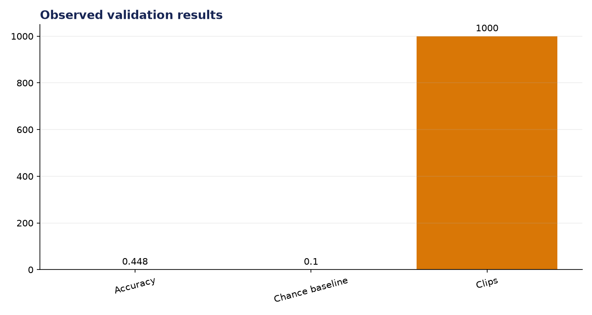
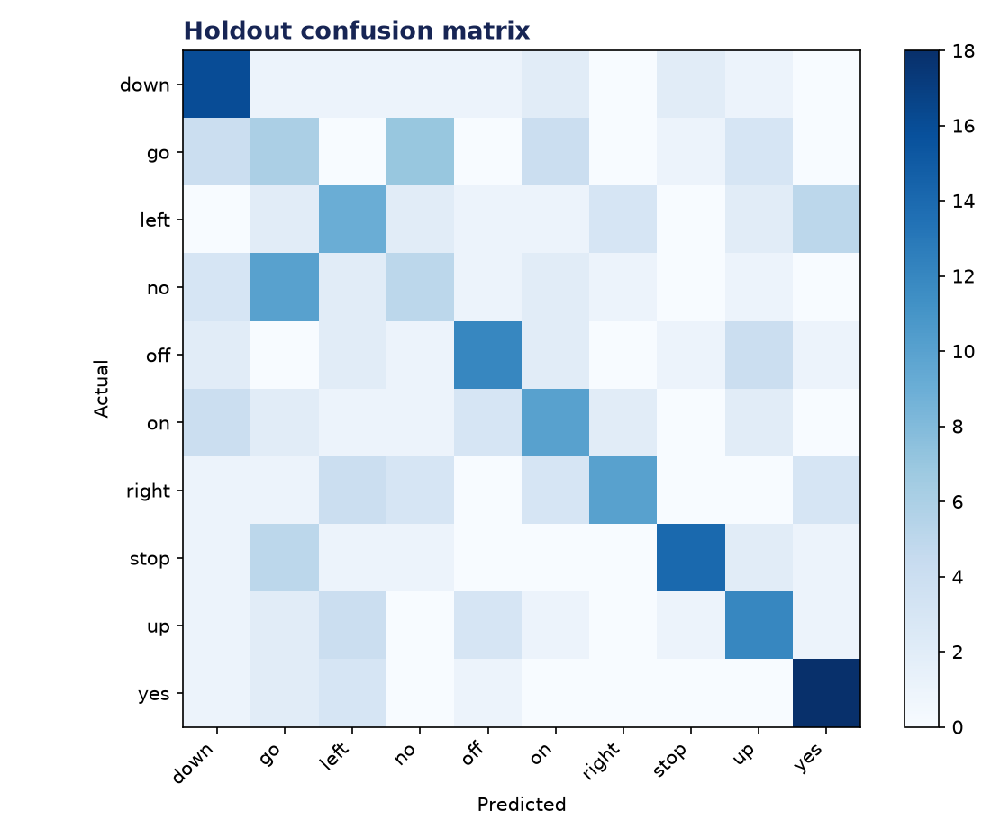

# Analysis Report: Audio Keyword Spotting

**Author:** Edward Ocran  
**Project:** 68  
**Validation status:** Passed

## Executive finding

The keyword spotter trained on 1,000 official Google Speech Commands recordings—100 examples for each of ten commands—and achieved 44.8% holdout accuracy. The result is 4.48 times the random baseline.



## Evidence and interpretation

“Yes,” “down,” and “stop” were among the stronger commands, while short acoustically similar words such as “go,” “no,” “on,” and “off” remained harder. The confusion matrix makes clear that the classifier is learning speech structure, but compact hand-built features do not yet match a purpose-trained CNN on mel spectrograms.



## Method

The implementation follows the supplied project sequence: audio acquisition, preprocessing, the stated model or tool stage, and a checked output. Dataset-backed projects use balanced subsets with their exact sample counts stated above. Fast validation uses small local fixtures only to keep continuous integration dependency-light; the metrics in this report come from the real validation run.

## Limitations and next step

A speaker-independent split, background-noise augmentation, and a small convolutional network are the next priorities. Wake-word systems should also report false activations per hour, not accuracy alone.

## Reproduce

```powershell
pip install -r requirements.txt
python download_data.py  # where included
python main.py --help
python -m unittest -v test_project.py
```

See `DATASET.md` for source and handling details.
