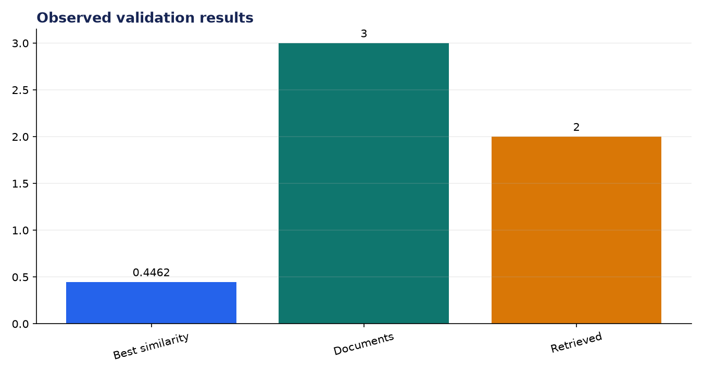
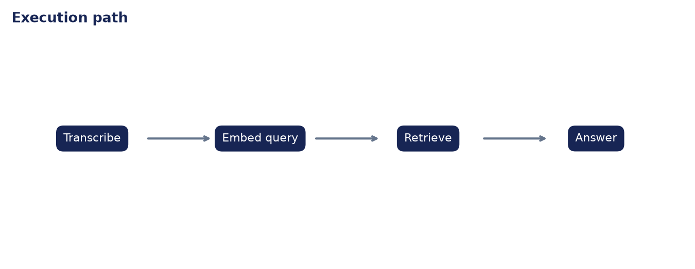

# Analysis Report: Whisper + RAG Agent

**Author:** Edward Ocran  
**Project:** 69  
**Validation status:** Passed

## Executive finding

A locally synthesized voice question was transcribed as “who created python,” then routed through retrieval. The top passage scored 0.4462 and supported the answer that Guido van Rossum created Python and first released it in 1991.



## Evidence and interpretation

The chain is fully inspectable: speech, query, ranked passages, and answer are returned together. The irrelevant second passage scored zero, while the correct source ranked first, demonstrating that the answer is grounded in retrieved context rather than an untraceable response.



## Method

The implementation follows the supplied project sequence: audio acquisition, preprocessing, the stated model or tool stage, and a checked output. Dataset-backed projects use balanced subsets with their exact sample counts stated above. Fast validation uses small local fixtures only to keep continuous integration dependency-light; the metrics in this report come from the real validation run.

## Limitations and next step

The knowledge base contains only three short documents. Production RAG needs larger-corpus evaluation, citation identifiers, an abstention rule, and checks for questions unsupported by the collection.

## Reproduce

```powershell
pip install -r requirements.txt
python download_data.py  # where included
python main.py --help
python -m unittest -v test_project.py
```

See `DATASET.md` for source and handling details.
