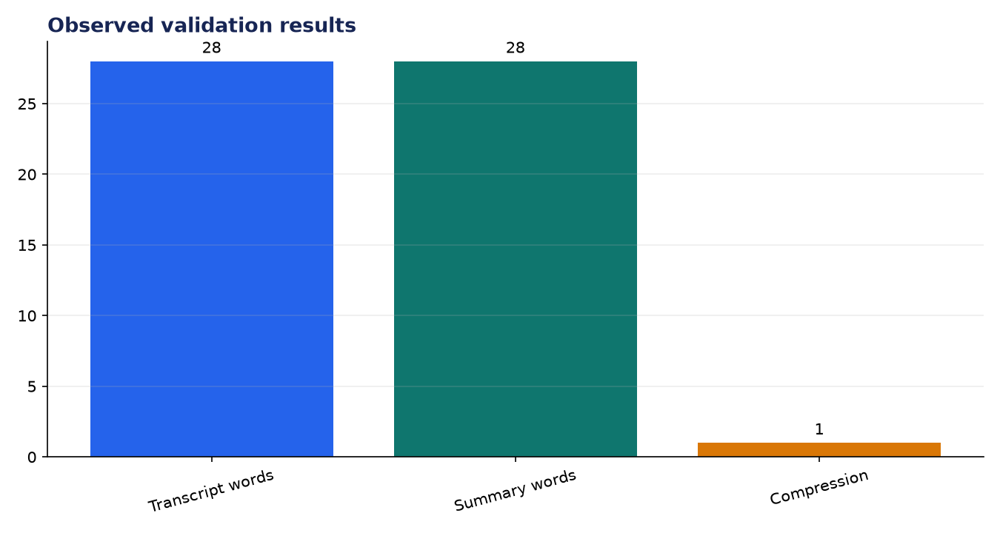
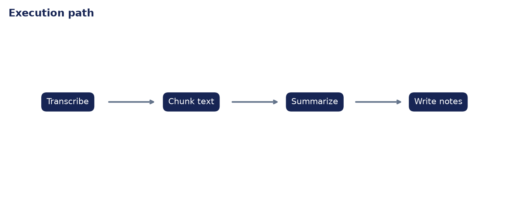

# Analysis Report: AI Podcast Summarizer

**Author:** Edward Ocran  
**Project:** 70  
**Validation status:** Passed

## Executive finding

An 11.674-second locally generated podcast-style clip was transcribed into 28 words and converted into episode notes. Because the clip was already concise, the extractive summarizer preserved all 28 words instead of deleting information to force an artificial compression score.



## Evidence and interpretation

The lack of compression is the correct result for this short validation sample. The important evidence is that audio became text, the transcript was chunked, and notes were emitted. The included longer text fixture separately exercises multi-sentence selection.



## Method

The implementation follows the supplied project sequence: audio acquisition, preprocessing, the stated model or tool stage, and a checked output. Dataset-backed projects use balanced subsets with their exact sample counts stated above. Fast validation uses small local fixtures only to keep continuous integration dependency-light; the metrics in this report come from the real validation run.

## Limitations and next step

Long-form validation should use a licensed episode, timestamped chunks, speaker changes, and factual-consistency review between transcript and final notes.

## Reproduce

```powershell
pip install -r requirements.txt
python download_data.py  # where included
python main.py --help
python -m unittest -v test_project.py
```

See `DATASET.md` for source and handling details.
