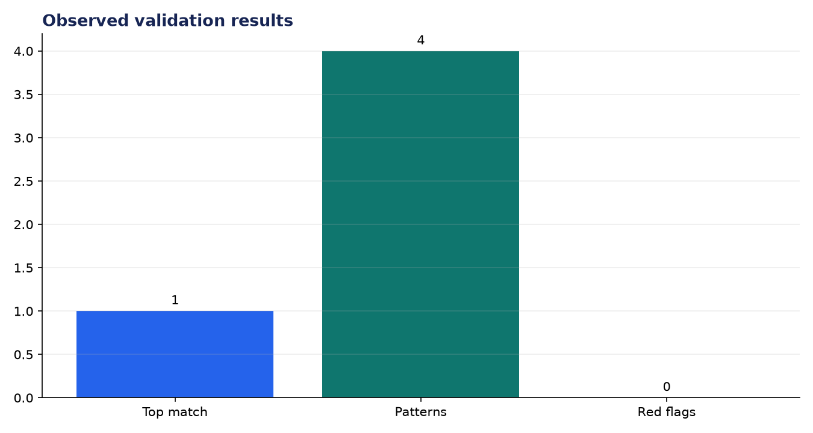
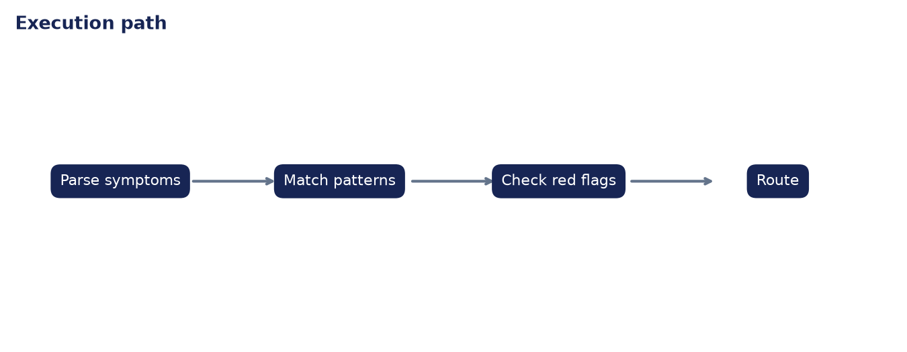

# Analysis Report: Medical Diagnosis Support Tool

**Author:** Edward Ocran

## Executive finding

The intake example matched all four influenza-like terms and triggered no emergency red flag. The response is framed as pattern support and routes the user to clinical review rather than presenting a definitive diagnosis.



## Evidence and interpretation

Exact symptom overlap makes this workflow auditable. The safety value is the independent red-flag route: chest pain or shortness of breath overrides ordinary similarity and recommends emergency evaluation.



## Method

The implementation follows the supplied PDF workflow and reports the held-out or end-to-end validation result. Dataset retrieval and provenance are separated from modeling so the experiment can be repeated without committing third-party data.

## Limitations and next step

The knowledge base is deliberately narrow. Clinical deployment requires validated terminology, prevalence-aware differentials, age and medication context, and governance by licensed professionals.

## Reproduce

```powershell
pip install -r requirements.txt
python download_data.py  # where included
python main.py --help
python -m unittest -v test_project.py
```
