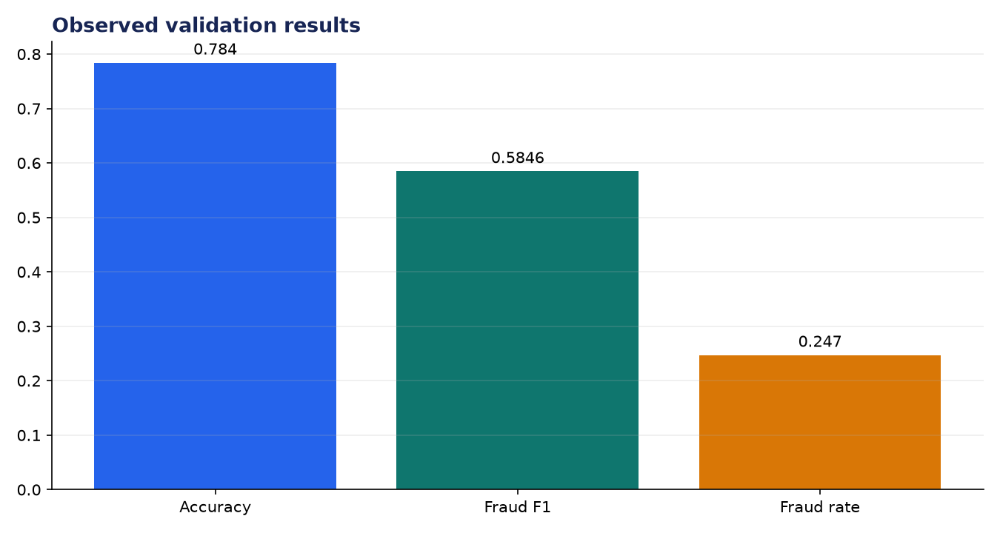
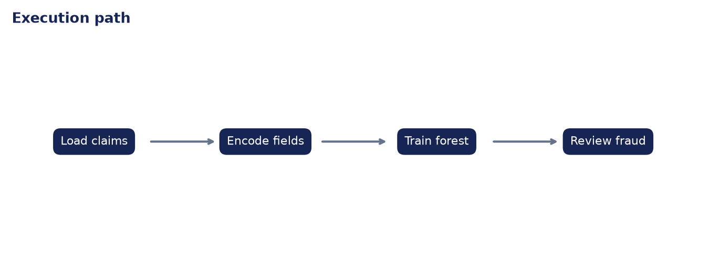

# Analysis Report: Insurance Claim Classifier

**Author:** Edward Ocran

## Executive finding

On 1,000 Kaggle auto claims, the model reached 78.4% accuracy and 0.5846 fraud F1 against a 24.7% fraud rate.



## Evidence and interpretation

Accuracy alone would flatter a majority-class model. The fraud recall of 61.29% and precision of 55.88% show a useful screening signal, but also a material review burden and missed-case risk.



## Method

The implementation follows the supplied PDF workflow and reports the held-out or end-to-end validation result. Dataset retrieval and provenance are separated from modeling so the experiment can be repeated without committing third-party data.

## Limitations and next step

This should prioritize investigations, not deny claims. Thresholds need cost-based calibration, drift monitoring, and fairness testing across protected groups.

## Reproduce

```powershell
pip install -r requirements.txt
python download_data.py  # where included
python main.py --help
python -m unittest -v test_project.py
```
