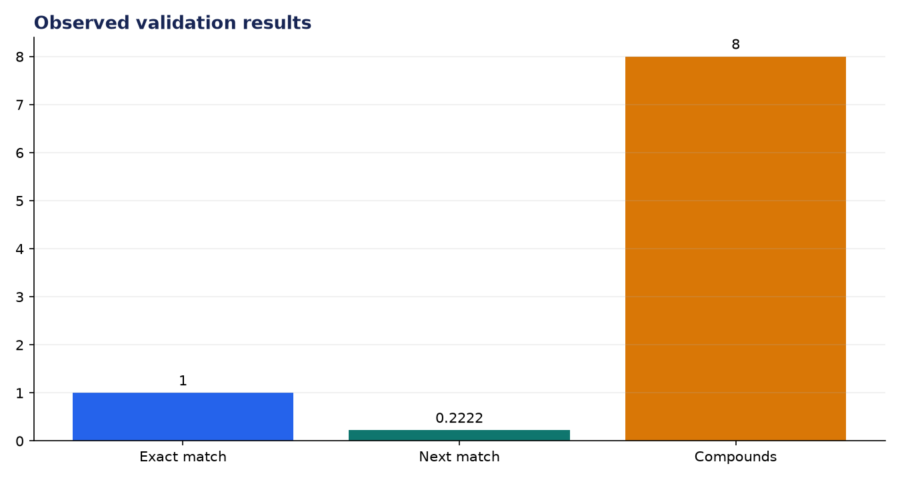
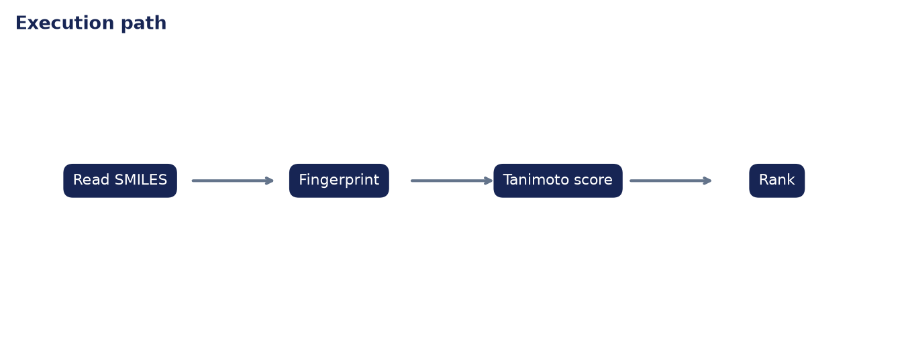

# Analysis Report: Drug Similarity Finder

**Author:** Edward Ocran

## Executive finding

The PubChem-backed search ranked acetaminophen itself at 1.000 and aspirin second at 0.2222 across eight common medicines.



## Evidence and interpretation

The low second-place score is informative: these medicines may share analgesic use without close Morgan-fingerprint structure. Structural and therapeutic similarity are different questions and should not be conflated.



## Method

The implementation follows the supplied PDF workflow and reports the held-out or end-to-end validation result. Dataset retrieval and provenance are separated from modeling so the experiment can be repeated without committing third-party data.

## Limitations and next step

A useful discovery system needs a larger ChEMBL or PubChem library, stereochemistry controls, activity targets, and expert interpretation; similarity is not evidence of equivalent safety or efficacy.

## Reproduce

```powershell
pip install -r requirements.txt
python download_data.py  # where included
python main.py --help
python -m unittest -v test_project.py
```
