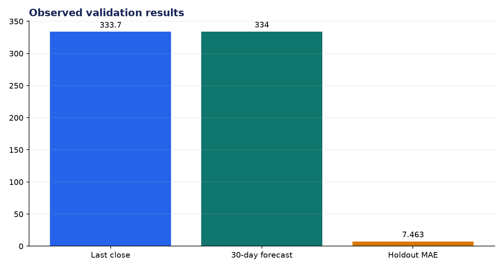
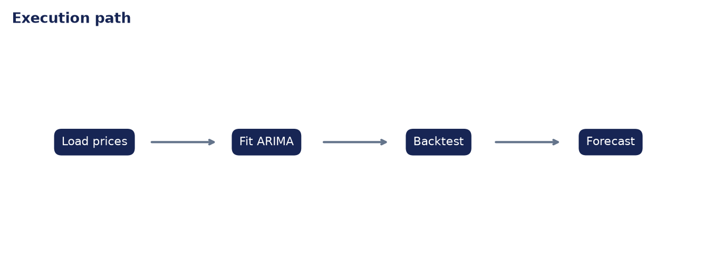

# Analysis Report: Financial Forecasting Agent

**Author:** Edward Ocran

## Executive finding

The ARIMA model used 1,255 AAPL observations. Its 30-session point forecast was $334.04 versus a latest close of $333.69, with a wide $296.69–$371.39 interval.



## Evidence and interpretation

The near-flat point estimate is less important than the interval. A $74.70 span signals substantial uncertainty, while the 20-day holdout MAE of $7.46 provides an empirical scale for typical forecast error.



## Method

The implementation follows the supplied PDF workflow and reports the held-out or end-to-end validation result. Dataset retrieval and provenance are separated from modeling so the experiment can be repeated without committing third-party data.

## Limitations and next step

This is trend analysis, not investment advice. Exogenous events, splits, regime changes, and transaction costs are outside the univariate model.

## Reproduce

```powershell
pip install -r requirements.txt
python download_data.py  # where included
python main.py --help
python -m unittest -v test_project.py
```
