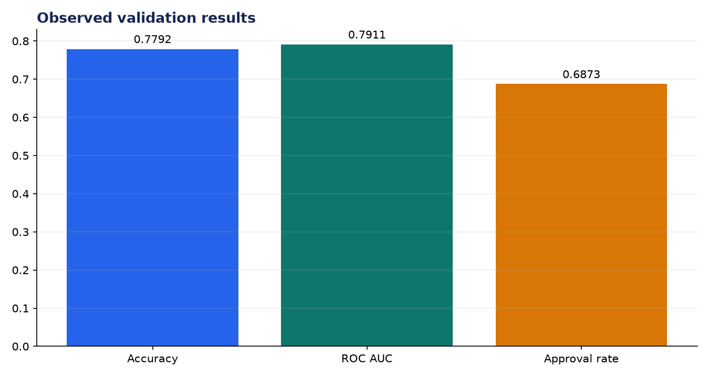
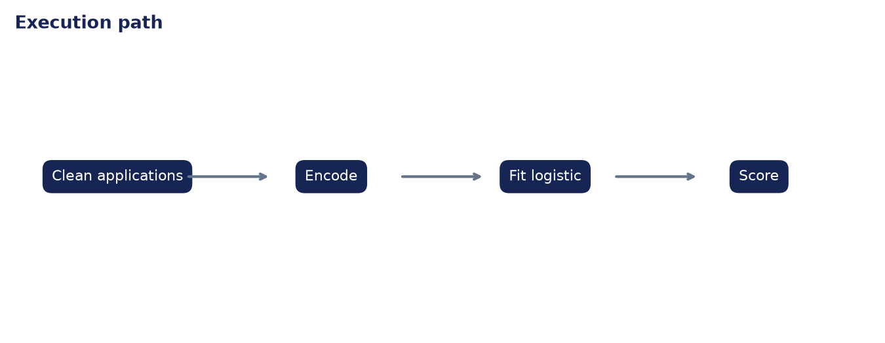

# Analysis Report: AI Loan Eligibility Checker

**Author:** Edward Ocran

## Executive finding

The Kaggle loan model evaluated 614 applications, reaching 77.92% accuracy and 0.7911 ROC AUC; 68.73% of the records were approved.



## Evidence and interpretation

ROC AUC shows useful ranking power beyond the majority approval rate. Because lending errors have unequal consequences, the classification threshold should be chosen from a documented approval and loss policy rather than fixed at 0.5.



## Method

The implementation follows the supplied PDF workflow and reports the held-out or end-to-end validation result. Dataset retrieval and provenance are separated from modeling so the experiment can be repeated without committing third-party data.

## Limitations and next step

This is a pre-screening demonstration. Protected attributes, disparate impact, adverse-action reasons, calibration, and regulatory review are mandatory before real lending use.

## Reproduce

```powershell
pip install -r requirements.txt
python download_data.py  # where included
python main.py --help
python -m unittest -v test_project.py
```
