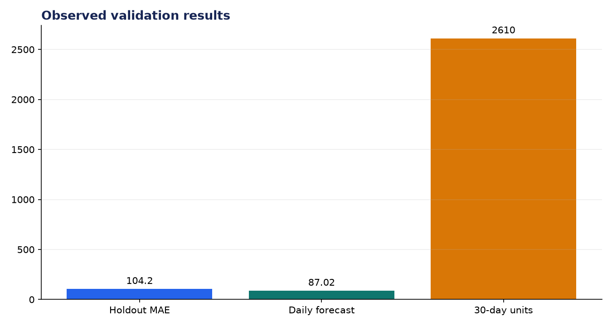
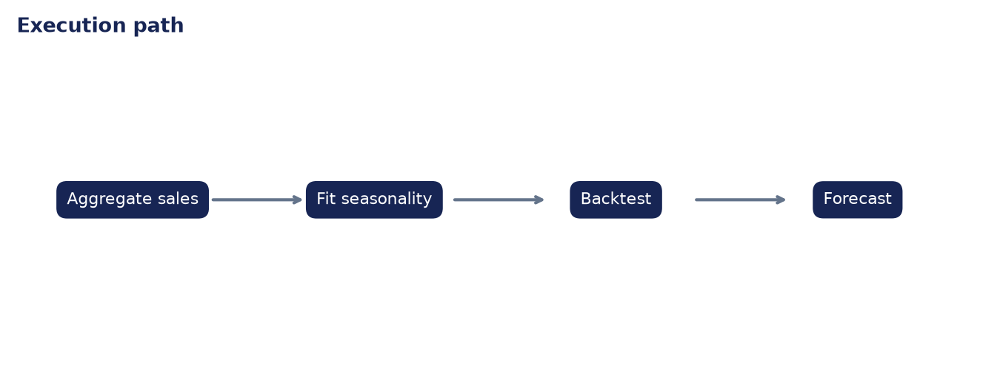

# Analysis Report: Retail Sales Predictor

**Author:** Edward Ocran

## Executive finding

Using 374 days from UCI Online Retail, the seasonal forecast projects 2,610.5 units over 30 days, or 87.02 per day. Holdout MAE was 104.25 units.



## Evidence and interpretation

The error exceeds the projected daily mean, so the point forecast is not precise enough for tight replenishment. It is better suited to a broad capacity range while promotions, stockouts, and outlier orders are modeled explicitly.



## Method

The implementation follows the supplied PDF workflow and reports the held-out or end-to-end validation result. Dataset retrieval and provenance are separated from modeling so the experiment can be repeated without committing third-party data.

## Limitations and next step

The series covers one high-activity product and zeros on non-selling days. Hierarchical store/product modeling and prediction intervals are the next steps.

## Reproduce

```powershell
pip install -r requirements.txt
python download_data.py  # where included
python main.py --help
python -m unittest -v test_project.py
```
