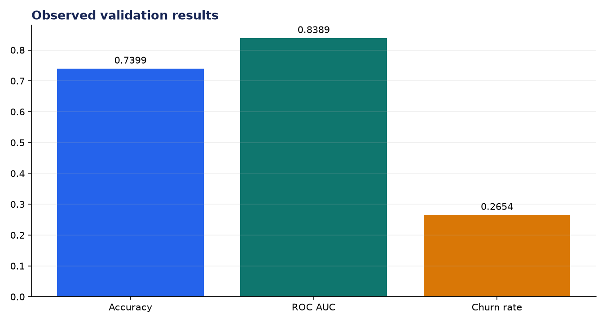
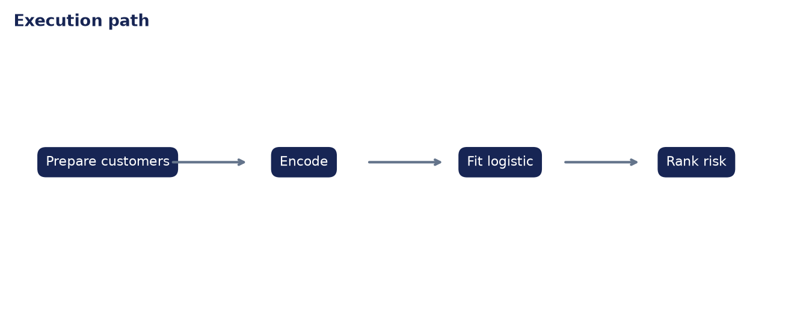

# Analysis Report: Customer Churn Predictor

**Author:** Edward Ocran

## Executive finding

The IBM Telco model trained on 7,043 customers and produced 73.99% accuracy with 0.8389 ROC AUC against a 26.54% churn rate.



## Evidence and interpretation

The gap between accuracy and ROC AUC indicates that ranking is stronger than the default thresholded decision. Retention teams should select a cutoff from intervention capacity and expected value, then evaluate lift in the contacted deciles.



## Method

The implementation follows the supplied PDF workflow and reports the held-out or end-to-end validation result. Dataset retrieval and provenance are separated from modeling so the experiment can be repeated without committing third-party data.

## Limitations and next step

This is observational churn data. Model scores do not prove that a retention offer will change behavior; an experiment is needed to estimate incremental impact.

## Reproduce

```powershell
pip install -r requirements.txt
python download_data.py  # where included
python main.py --help
python -m unittest -v test_project.py
```
