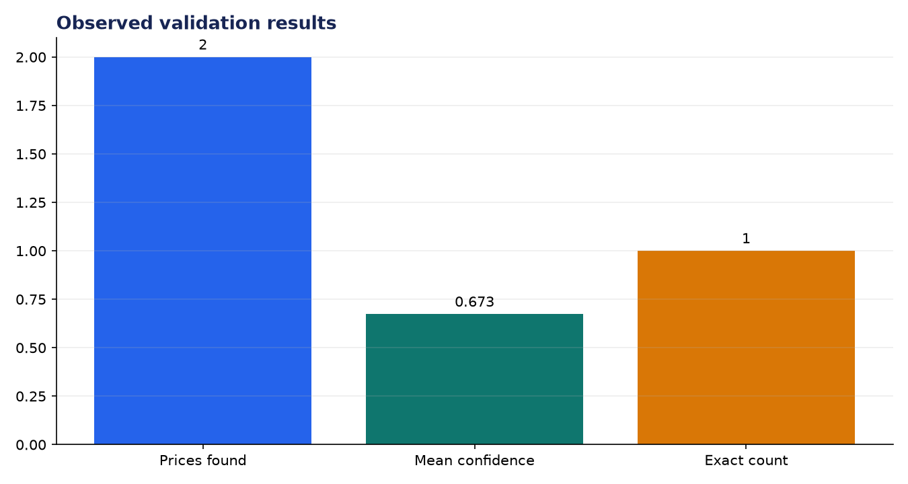
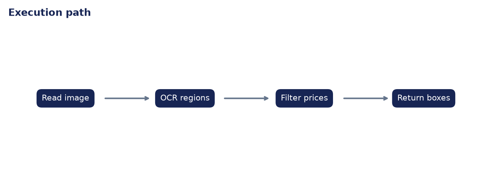

# Analysis Report: Visual Price Tag Detection for Retail

**Author:** Edward Ocran

## Executive finding

EasyOCR located both prices in the retail fixture: $3.49 and 7.99. Mean OCR confidence was 0.673, with the second price at 0.950 and the first at 0.397.



## Evidence and interpretation

The count is correct, but confidence exposes an operational difference hidden by exact detection: the currency symbol and typography depressed the first tag. Low-confidence reads should be queued for review rather than silently accepted.



## Method

The implementation follows the supplied PDF workflow and reports the held-out or end-to-end validation result. Dataset retrieval and provenance are separated from modeling so the experiment can be repeated without committing third-party data.

## Limitations and next step

The fixture is controlled. Store glare, angled shelves, small tags, crossed-out prices, and multiple currencies require a photographed benchmark and detector-plus-OCR evaluation.

## Reproduce

```powershell
pip install -r requirements.txt
python download_data.py  # where included
python main.py --help
python -m unittest -v test_project.py
```
