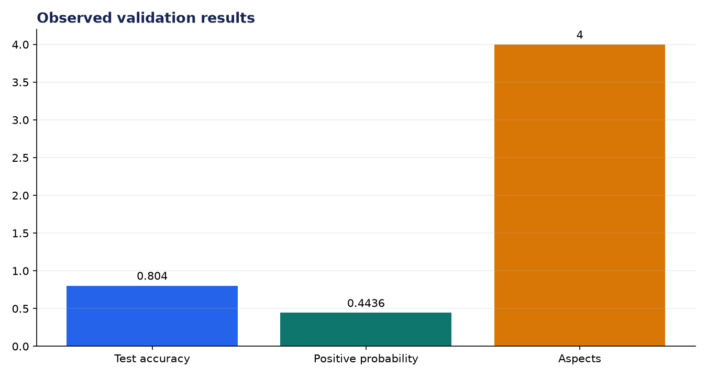
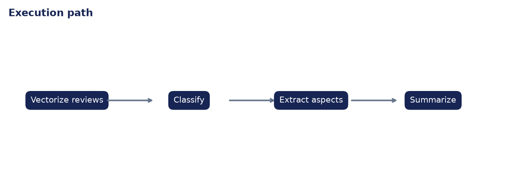

# Analysis Report: Product Review Analyzer

**Author:** Edward Ocran

## Executive finding

The sentiment model achieved 80.4% accuracy on 1,000 UCI Amazon reviews. The mixed laptop review scored 44.36% positive while exposing four aspects: battery, display, performance, and support.



## Evidence and interpretation

A single overall label misses the commercial signal. Battery is negative while display, performance, and support are positive; the aspect list preserves where product and service teams should act.



## Method

The implementation follows the supplied PDF workflow and reports the held-out or end-to-end validation result. Dataset retrieval and provenance are separated from modeling so the experiment can be repeated without committing third-party data.

## Limitations and next step

The training labels are sentence-level and binary. Aspect-specific polarity, neutral sentiment, sarcasm, and category drift need additional annotation.

## Reproduce

```powershell
pip install -r requirements.txt
python download_data.py  # where included
python main.py --help
python -m unittest -v test_project.py
```
