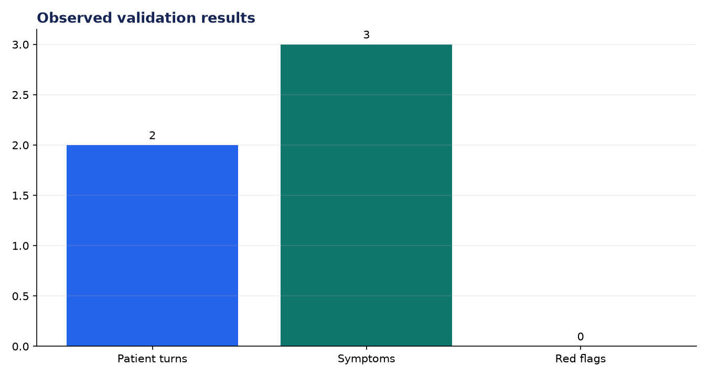
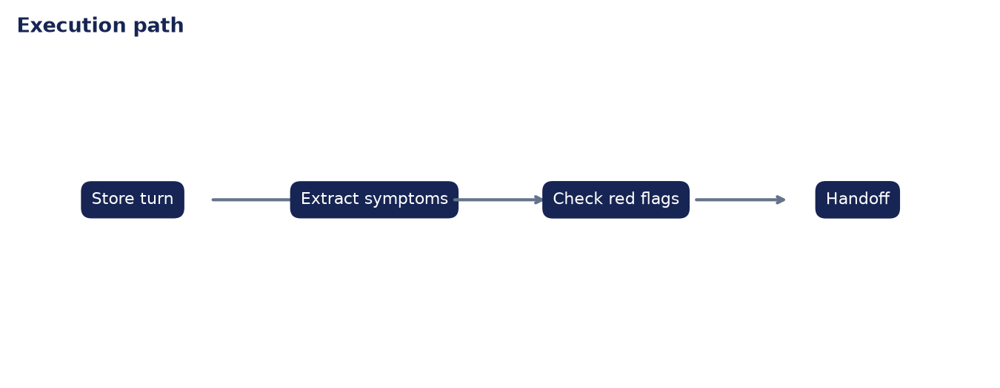

# Analysis Report: Doctor-Patient Conversational AI

**Author:** Edward Ocran

## Executive finding

The intake dialogue retained two patient turns, extracted fever, sore throat, and cough, and produced a concise hand-off with no emergency flag.



## Evidence and interpretation

The assistant asks for duration before expanding the assessment, which makes the exchange purposeful rather than conversational filler. Red flags are checked at every turn and override the ordinary follow-up path.



## Method

The implementation follows the supplied PDF workflow and reports the held-out or end-to-end validation result. Dataset retrieval and provenance are separated from modeling so the experiment can be repeated without committing third-party data.

## Limitations and next step

The dialogue engine is an intake aid only. Identity, consent, privacy controls, medication history, clinician review, and validated escalation protocols are required for healthcare use.

## Reproduce

```powershell
pip install -r requirements.txt
python download_data.py  # where included
python main.py --help
python -m unittest -v test_project.py
```
