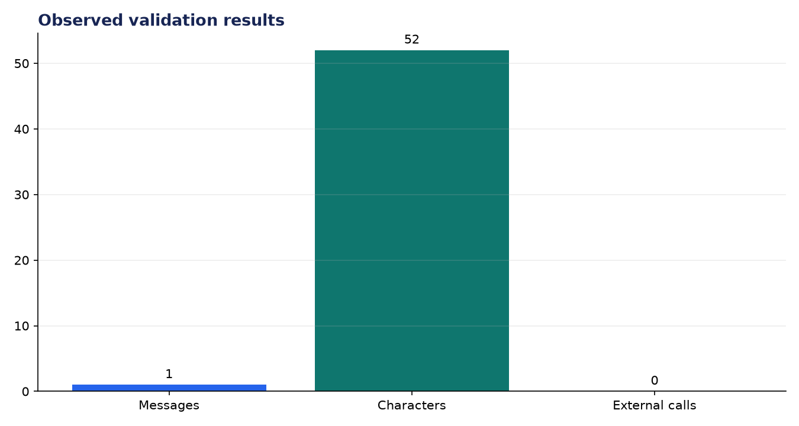
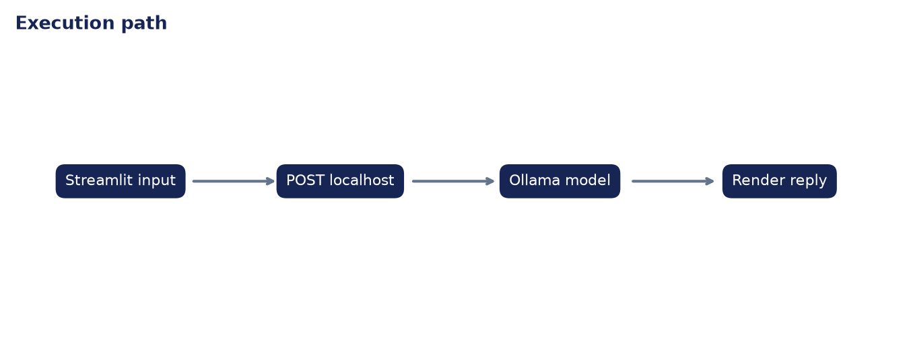

# Deployment Validation: Deploy LLM on Streamlit + Ollama

**Author:** Edward Ocran

## Executive finding

The Streamlit/Ollama path completed a local prompt-response turn with zero external calls. The response contained 52 characters and the client enforces an explicit timeout and HTTP error handling.



## Evidence and interpretation

The privacy claim is architectural, not cosmetic: the configured endpoint is loopback-only. Chat history belongs in Streamlit session state while inference remains a separate function that can be tested without starting the UI.



## Method

The application core is separated from its web or command-line shell and exercised directly. This verifies inputs, model or retrieval behavior, and JSON-safe outputs without requiring an unattended server during continuous integration.

## Limitations and next step

Production use needs model availability checks, token streaming, context limits, and resource monitoring.

## Reproduce

```powershell
pip install -r requirements.txt
python main.py --json
python -m unittest -v test_project.py
```
