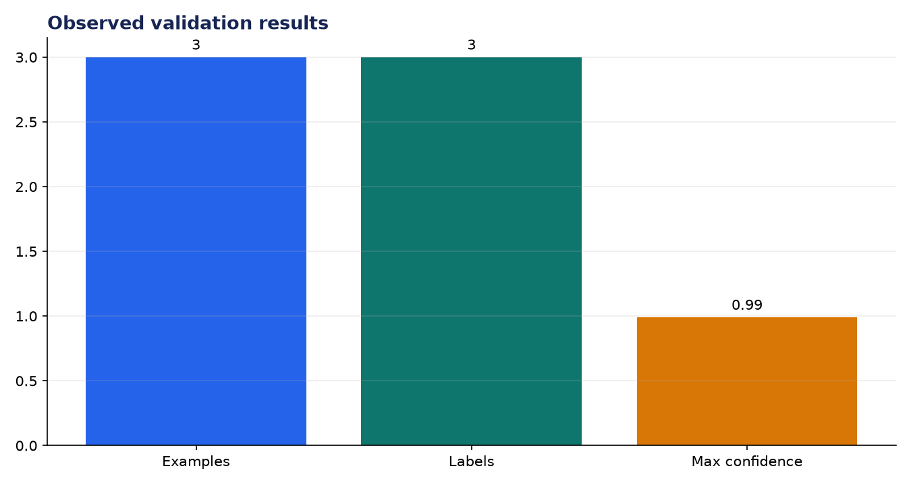
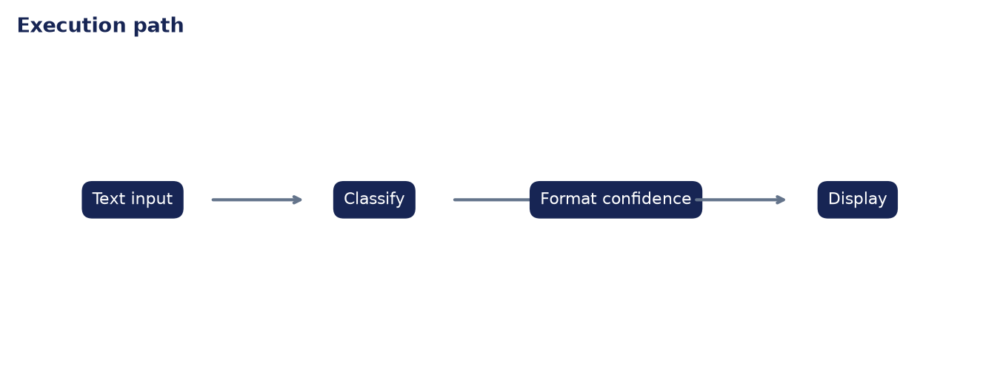

# Deployment Validation: Gradio App - Text Classifier

**Author:** Edward Ocran

## Executive finding

The Gradio classifier exercised positive, negative, and neutral outcomes across three inputs, with 0.99 confidence on the two polarity-bearing examples.



## Evidence and interpretation

Separating `classify` from the interface keeps the model logic independently testable. Neutral is returned when evidence is tied, avoiding a forced polarity label.



## Method

The application core is separated from its web or command-line shell and exercised directly. This verifies inputs, model or retrieval behavior, and JSON-safe outputs without requiring an unattended server during continuous integration.

## Limitations and next step

The lightweight vocabulary model is a deployment scaffold; a trained classifier and out-of-domain evaluation are needed for general text.

## Reproduce

```powershell
pip install -r requirements.txt
python main.py --json
python -m unittest -v test_project.py
```
