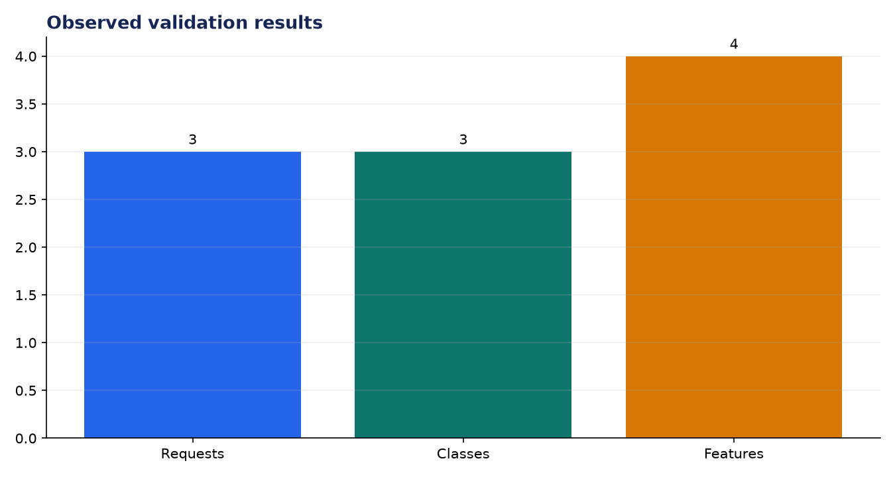
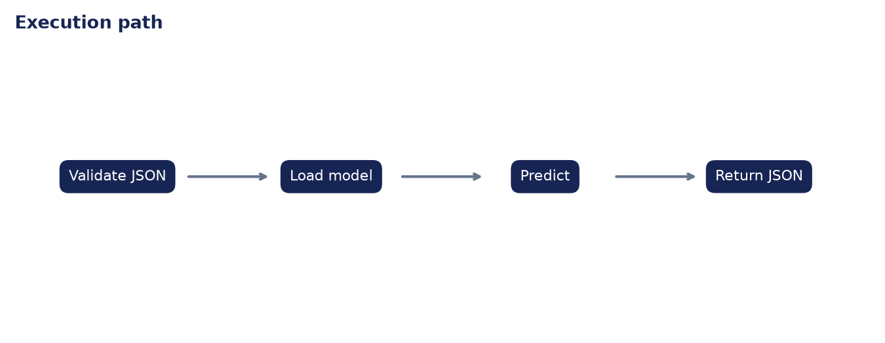

# Deployment Validation: FastAPI for Model Inference

**Author:** Edward Ocran

## Executive finding

Three Iris payloads covering all three species were accepted by the inference core, each with the required four numerical features.



## Evidence and interpretation

The Pydantic schema makes malformed requests fail before reaching the model, while the response converts NumPy output to a JSON-safe integer.



## Method

The application core is separated from its web or command-line shell and exercised directly. This verifies inputs, model or retrieval behavior, and JSON-safe outputs without requiring an unattended server during continuous integration.

## Limitations and next step

Operational deployment should persist the trained model artifact, version the schema, add health checks, and test latency under concurrency.

## Reproduce

```powershell
pip install -r requirements.txt
python main.py --json
python -m unittest -v test_project.py
```
