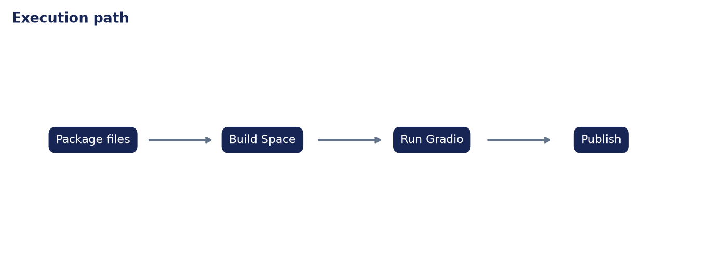

# Analysis Report: Create a Hugging Face Space

**Author:** Edward Ocran

## Executive finding

The Space bundle contains the Gradio app, dependency file, and tested classifier core. Three examples produced all three supported labels.


## Evidence and interpretation

Keeping `app.py` small reduces hosting failure points: the Space imports one pure classification function and handles only presentation.



## Method

The application core is separated from its web or command-line shell and exercised directly. This verifies inputs, model or retrieval behavior, and JSON-safe outputs without requiring an unattended server during continuous integration.

## Limitations and next step

The repository prepares the deployable artifact; account-specific Space creation and publication remain an explicit owner action.

## Reproduce

```powershell
pip install -r requirements.txt
python main.py --json
python -m unittest -v test_project.py
```
