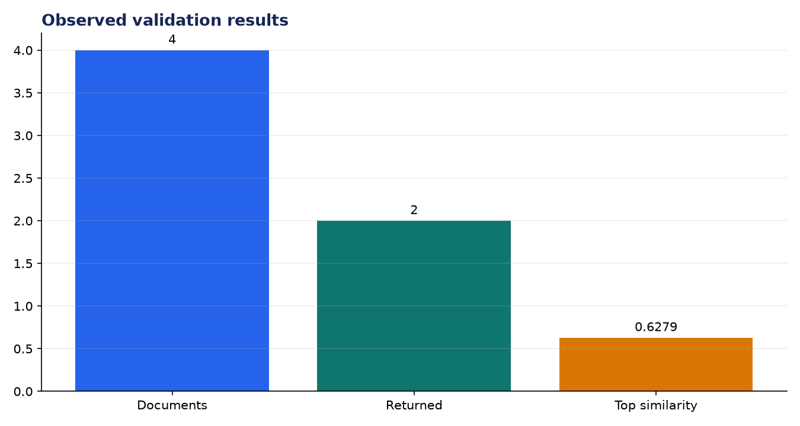
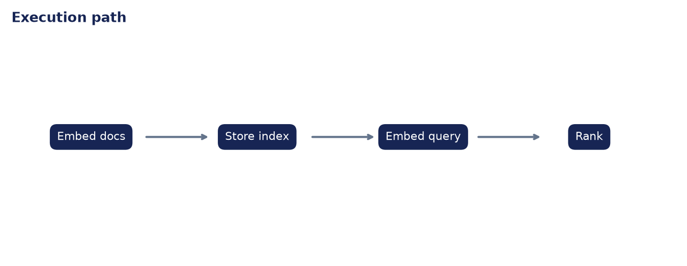

# Deployment Validation: Build and Query Your Own Vector DB

**Author:** Edward Ocran

## Executive finding

The local index stored four documents and returned the ChromaDB definition first at 0.6279 similarity for a vector-database query.



## Evidence and interpretation

The second result scored zero, exposing an important cutoff decision. A production retriever should not present zero-similarity context merely to fill `top_k`.



## Method

The application core is separated from its web or command-line shell and exercised directly. This verifies inputs, model or retrieval behavior, and JSON-safe outputs without requiring an unattended server during continuous integration.

## Limitations and next step

The compact TF-IDF backend is inspectable but lexical. Persistent Chroma/FAISS storage and dense embeddings would improve semantic recall.

## Reproduce

```powershell
pip install -r requirements.txt
python main.py --json
python -m unittest -v test_project.py
```
