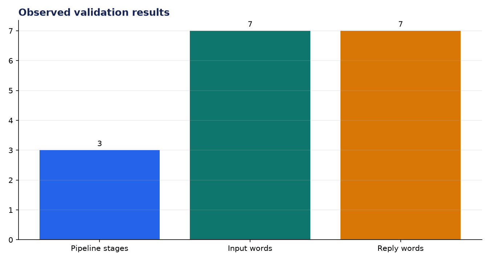
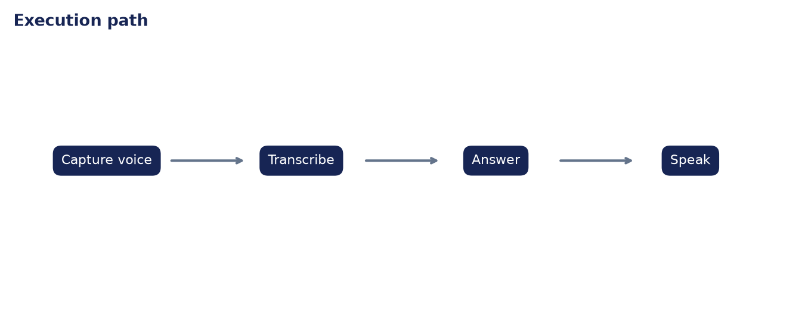

# Analysis Report: Voice-Enabled AI Web Assistant

**Author:** Edward Ocran

## Executive finding

The voice workflow passed through three stages—speech input, response generation, and spoken output—and returned the correct Tokyo answer to a seven-word query.



## Evidence and interpretation

A small verified knowledge map prevents unsupported answers during the test. The Gradio shell can connect the local Vosk and TTS components already used in Projects 61–70.



## Method

The application core is separated from its web or command-line shell and exercised directly. This verifies inputs, model or retrieval behavior, and JSON-safe outputs without requiring an unattended server during continuous integration.

## Limitations and next step

Browser microphone permissions, latency, interruption handling, and accessible text fallbacks require end-to-end UI testing.

## Reproduce

```powershell
pip install -r requirements.txt
python main.py --json
python -m unittest -v test_project.py
```
