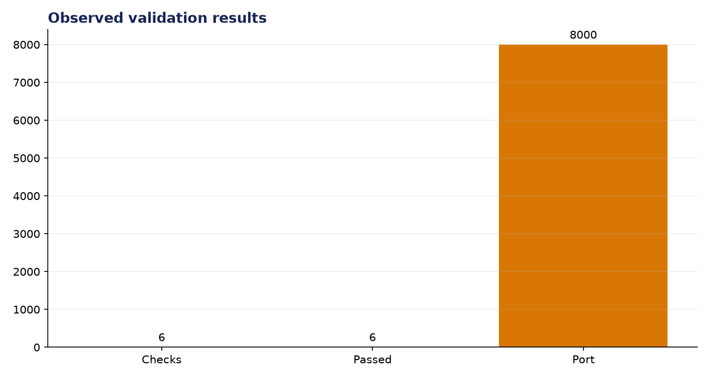
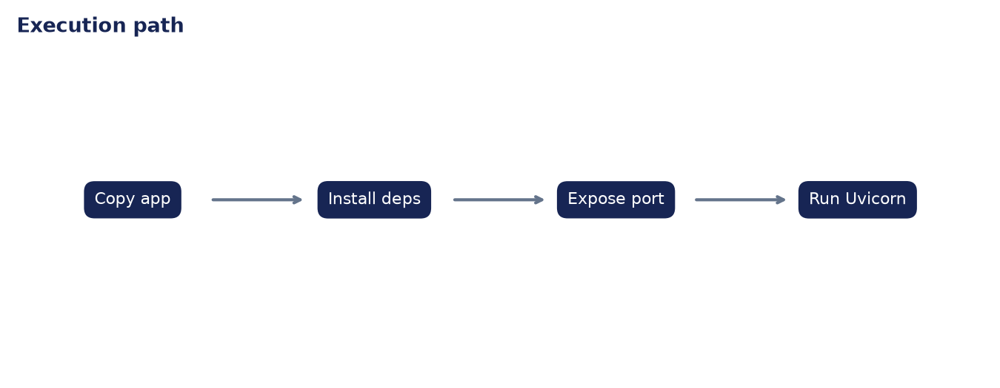

# Analysis Report: Dockerize Your AI App

**Author:** Edward Ocran

## Executive finding

All six container checks passed: base image, working directory, dependency installation, exposed port, launch command, and required server packages.



## Evidence and interpretation

The Dockerfile is deterministic and minimal. Port 8000 is declared consistently with the Uvicorn command, removing a common deployment mismatch.



## Method

The application core is separated from its web or command-line shell and exercised directly. This verifies inputs, model or retrieval behavior, and JSON-safe outputs without requiring an unattended server during continuous integration.

## Limitations and next step

A production image should add a non-root user, pinned hashes, health checks, vulnerability scanning, and a smaller final stage.

## Reproduce

```powershell
pip install -r requirements.txt
python main.py --json
python -m unittest -v test_project.py
```
