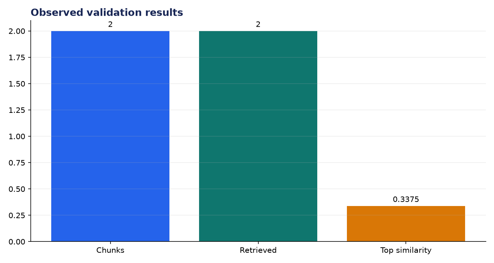
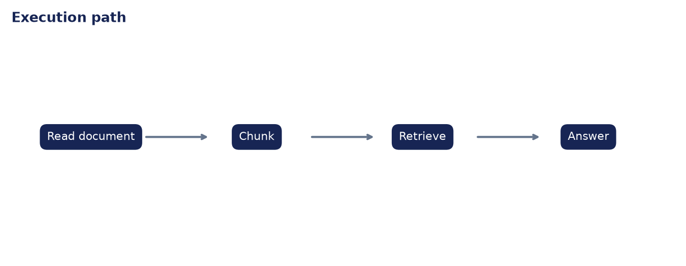

# Analysis Report: Build Local Document Q&A App

**Author:** Edward Ocran

## Executive finding

The local document was split into two boundary-safe chunks. Retrieval ranked the grounding passage first at 0.3375 and the answer reproduced that evidence directly.



## Evidence and interpretation

The returned passage list makes the answer auditable. The zero-score second chunk again shows why a similarity threshold is preferable to unconditional `top_k` filling.



## Method

The application core is separated from its web or command-line shell and exercised directly. This verifies inputs, model or retrieval behavior, and JSON-safe outputs without requiring an unattended server during continuous integration.

## Limitations and next step

PDF extraction, page citations, persistent storage, and a local generative model are the next integration steps.

## Reproduce

```powershell
pip install -r requirements.txt
python main.py --json
python -m unittest -v test_project.py
```
