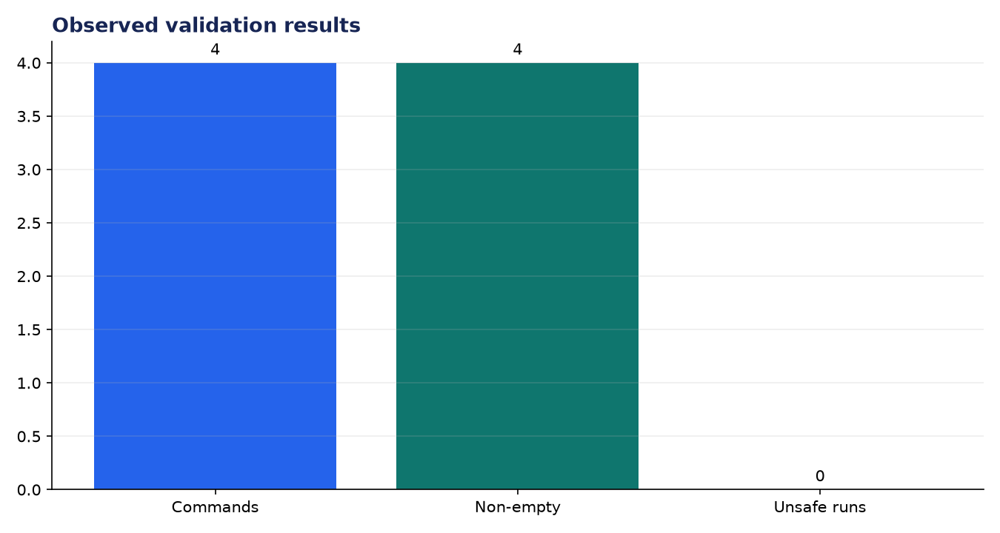
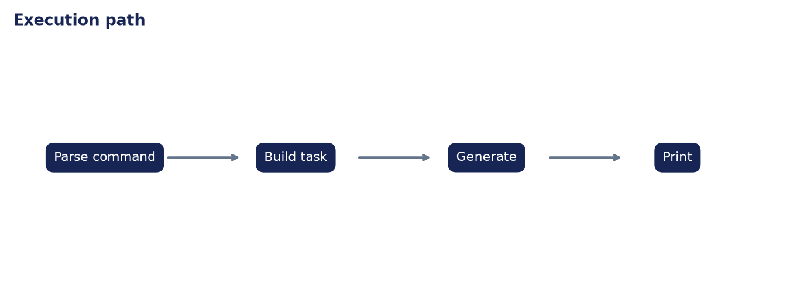

# Deployment Validation: Create an AI CLI Tool

**Author:** Edward Ocran

## Executive finding

Summarize, ask, code, and shell commands all returned non-empty results, and no generated shell or code output was executed automatically.



## Evidence and interpretation

That last metric is the key safety property: generation and execution are separate. Users can inspect output before choosing whether to run it.



## Method

The application core is separated from its web or command-line shell and exercised directly. This verifies inputs, model or retrieval behavior, and JSON-safe outputs without requiring an unattended server during continuous integration.

## Limitations and next step

A packaged CLI should add structured errors, stdin/file support, Ollama availability checks, and explicit confirmation for execution.

## Reproduce

```powershell
pip install -r requirements.txt
python main.py --json
python -m unittest -v test_project.py
```
