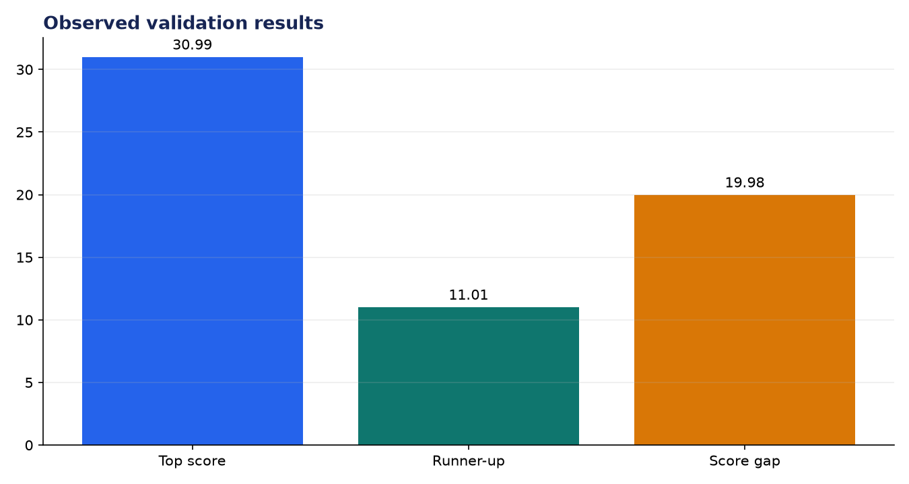
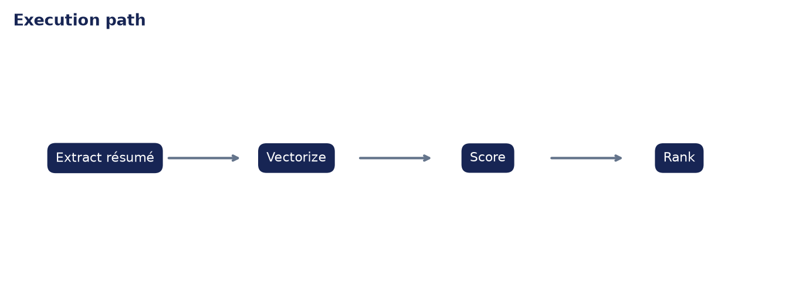

# Analysis Report: AI-Powered Resume Screener Web App

**Author:** Edward Ocran

## Executive finding

The transparent TF-IDF screen ranked the directly relevant analyst résumé first at 30.99%, 19.98 points ahead of the runner-up.



## Evidence and interpretation

The absolute score is modest because exact lexical overlap is intentionally limited; the ordering and visible gap are more useful than pretending the score is a hiring probability.



## Method

The application core is separated from its web or command-line shell and exercised directly. This verifies inputs, model or retrieval behavior, and JSON-safe outputs without requiring an unattended server during continuous integration.

## Limitations and next step

Scores must support, never replace, human review. Skills taxonomy, accessibility, bias audits, appeal paths, and exclusion of protected attributes are required.

## Reproduce

```powershell
pip install -r requirements.txt
python main.py --json
python -m unittest -v test_project.py
```
