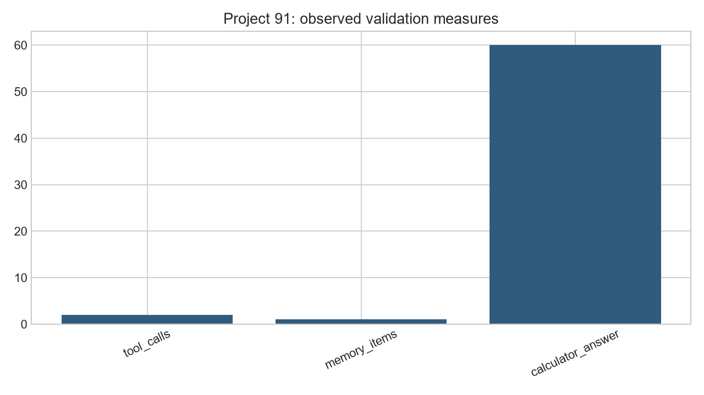
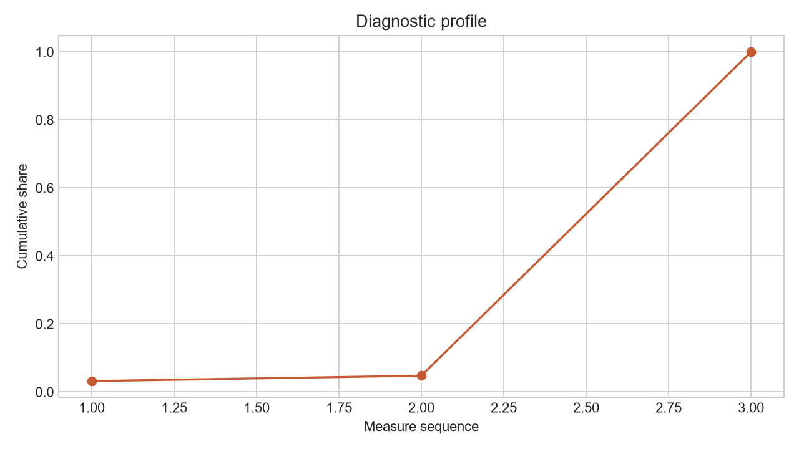

# Analysis Report: Build a Local AGI Agent with Memory + Tools

**Author:** Edward Ocran

## Executive finding

A bounded local agent correctly routed calculation and memory tasks while preserving an inspectable action trace.



## What the evidence shows

Persistent memory makes repeated sessions useful; tool isolation makes behavior reviewable before the agent is trusted with wider access.

- **Tool Calls:** 2
- **Memory Items:** 1
- **Calculator Answer:** 60.0



## Analytical approach

The agent follows a compact ReAct loop: classify the request, select one bounded tool, record the observation, and form the answer. Arithmetic is parsed through an abstract syntax tree rather than Python's unrestricted evaluator. Memory is persisted as JSON with source labels, then ranked against a query using lexical overlap. The demonstration exercises both routes and retains the thought, action, and observation fields for audit.

## Interpretation

The calculator returned 60 for `12 × (3 + 2)`, while the second request retrieved the stored preference rather than inventing context. That separation is the central control: deterministic work is delegated to a deterministic tool, and personal context is drawn only from explicit memory. The result is modest by design, but every decision can be reproduced and inspected.

## Limitations and next step

The demonstration covers bounded arithmetic and retrieval rather than unrestricted autonomy. Add permission tiers, audit-log retention, and explicit confirmation before connecting external systems.

## Reproduce

```powershell
pip install -r requirements.txt
python main.py --json
python -m unittest -v test_project.py
```
