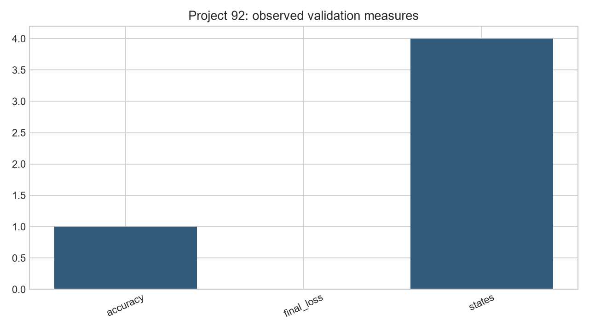
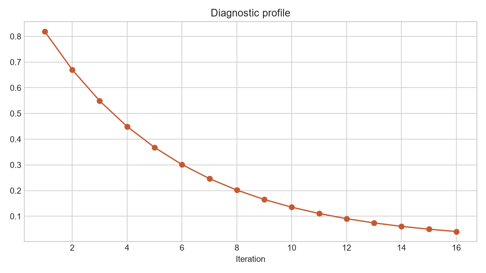

# Analysis Report: Quantum Circuit Classifier with PennyLane

**Author:** Edward Ocran

## Executive finding

The XOR classifier reached 100% training accuracy and converged to a low-loss separation of the four truth-table states.



## What the evidence shows

The interaction term is decisive: XOR is not linearly separable, so independent input rotations cannot express the target boundary without a joint feature.

- **Accuracy:** 1.0
- **Final Loss:** 0.000000000024
- **States:** 4



## Analytical approach

The implementation uses PennyLane's `default.qubit` simulator with two wires. Binary inputs are angle-encoded with `RY` rotations, a `CNOT` gate creates the parity interaction, trainable `Rot` gates supply the variational parameters, and Adam minimizes mean squared error against the four XOR targets. A fixed seed makes the training path reproducible.

## Interpretation

All four expectation values converged to their target signs: equal inputs map to -1 and unequal inputs map to +1. The near-zero loss confirms that the trained circuit represents the truth table cleanly. This is a circuit-capability check; it should not be interpreted as an advantage over a classical XOR solution.

## Limitations and next step

Four observations are useful for circuit verification but not evidence of generalization. Test noisy simulators, repeated initializations, and hardware execution before drawing performance conclusions.

## Reproduce

```powershell
pip install -r requirements.txt
python main.py --json
python -m unittest -v test_project.py
```
