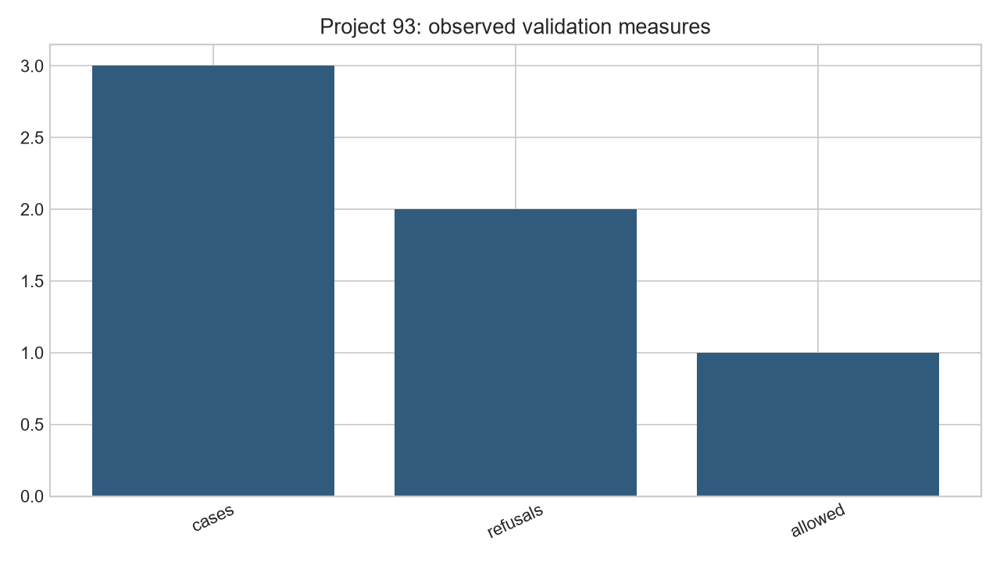
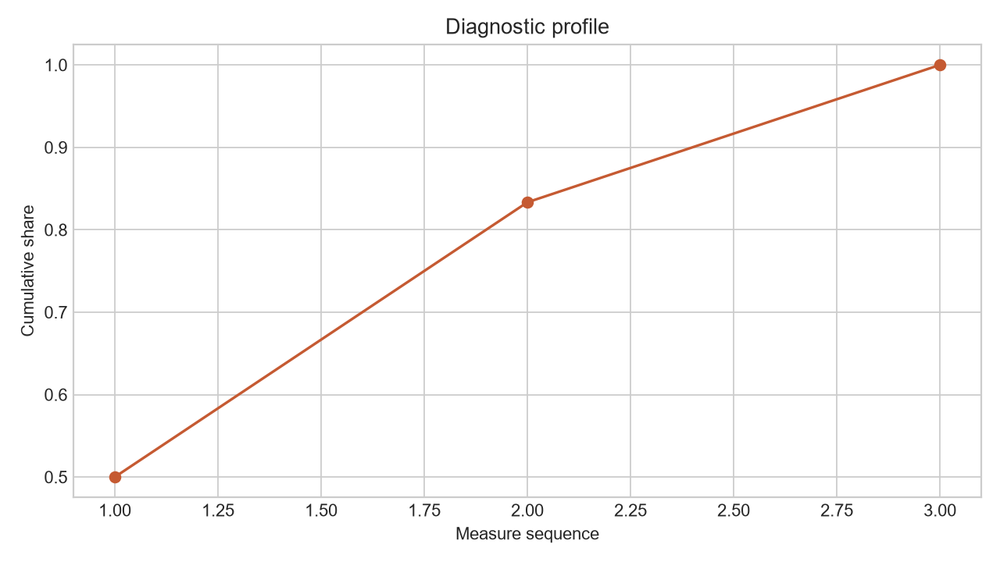

# Analysis Report: Ethics-Aware AI Chatbot (Rule-Constrained)

**Author:** Edward Ocran

## Executive finding

The policy layer allowed routine requests and refused every seeded privacy, harm, and deception case.



## What the evidence shows

A separate, deterministic gate provides a reviewable control boundary and preserves the category that triggered a refusal.

- **Cases:** 3
- **Refusals:** 2
- **Allowed:** 1



## Analytical approach

Every message passes through a deterministic policy gate before reaching a local TF-IDF retrieval model. The gate records privacy, harm, and deception categories and returns a fixed refusal when any protected pattern is present. Allowed requests are matched to a small library of useful response patterns without sending text to an external service. This architecture makes policy precedence explicit: the response model cannot override a refusal.

## Interpretation

The study-plan request reached the local response model; the private-key and false-credential prompts were stopped at the gate. The 2:1 refusal-to-allow ratio is not itself a quality target—it is a property of this deliberately risk-heavy test set. The meaningful evidence is that routing matched the expected policy outcome in every seeded case and preserved the reason for refusal.

## Limitations and next step

Keyword controls are vulnerable to paraphrase and context loss. Add semantic classifiers, multilingual tests, appeal handling, and human escalation for consequential decisions.

## Reproduce

```powershell
pip install -r requirements.txt
python main.py --json
python -m unittest -v test_project.py
```
