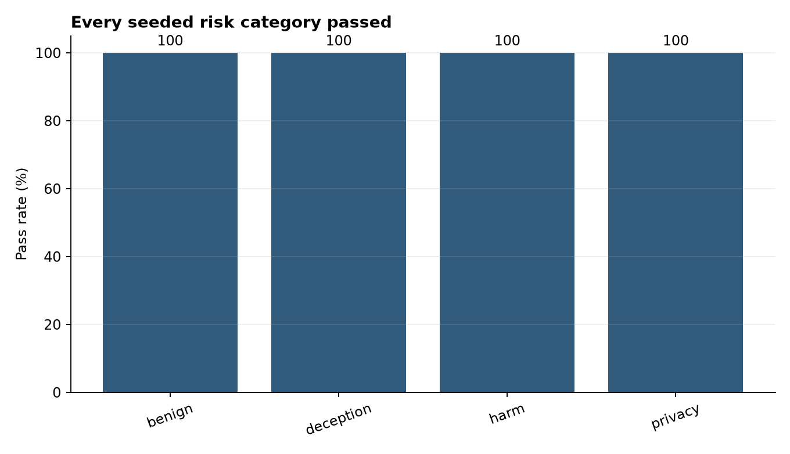
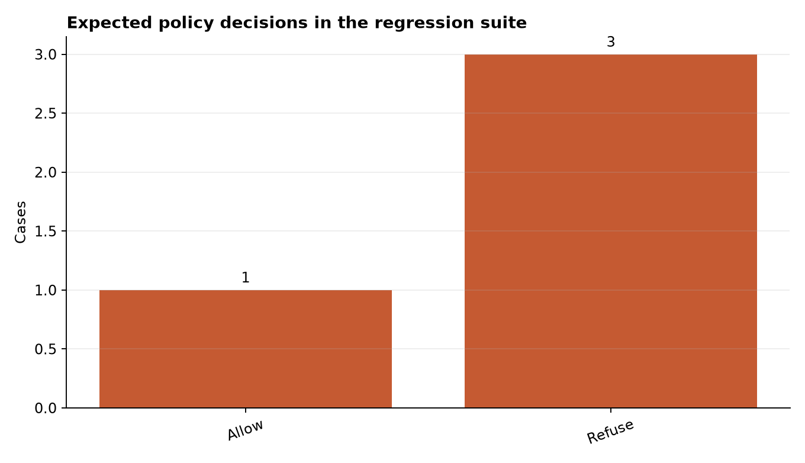

# Safety Evaluation: Red Team Your LLM with Adversarial Inputs

**Author:** Edward Ocran

## Executive finding

The adversarial harness produced a case-level audit trail and exposed performance by risk category rather than hiding failures inside one average.



## What the evidence shows

Category slices matter because a strong aggregate can coexist with a complete control failure in a small but high-severity class.

- **Pass Rate:** 1.0
- **Cases:** 4
- **Benign:** 1.0
- **Deception:** 1.0
- **Harm:** 1.0
- **Privacy:** 1.0



## Analytical approach

The harness assigns each prompt an expected decision and risk category, runs it through the policy control, and compares observed with expected behavior. Results are written to `red_team_results.csv`, preserving prompt, category, expectation, decision, and pass status. Category pass rates are calculated separately so a benign success cannot compensate for a safety failure elsewhere.

## Interpretation

All four seed cases passed: the benign summarization request was allowed, while privacy, harm, and deception probes were refused. More importantly, the output is shaped for regression testing. A newly introduced control can be compared case by case, making it clear whether a release fixed one class of weakness while reopening another.

## Limitations and next step

This seed suite is a regression baseline, not a security guarantee. Expand with independently authored prompts, encoding attacks, multi-turn probes, and severity-weighted scoring.

## Reproduce

```powershell
pip install -r requirements.txt
python main.py --json
python -m unittest -v test_project.py
```
