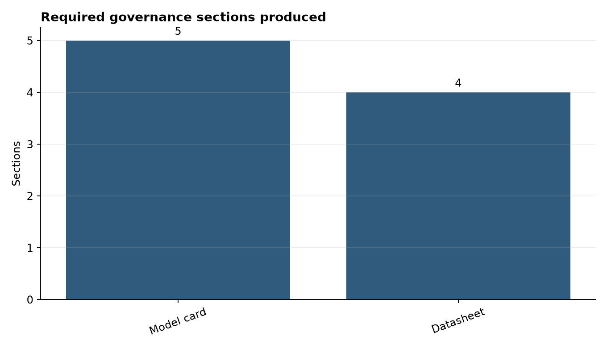
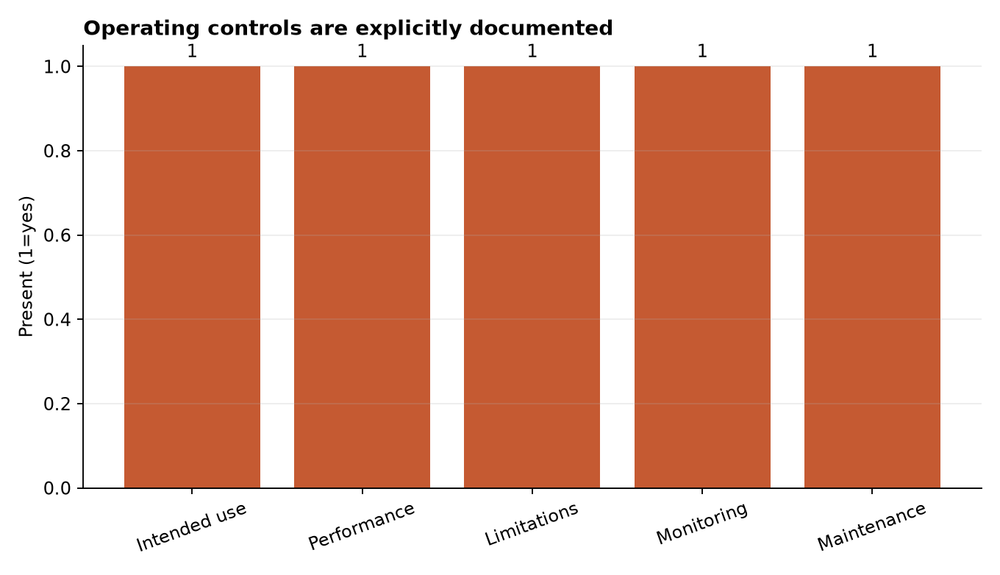

# Governance Artifact Evaluation: Model Cards + Datasheets Generator

**Author:** Edward Ocran

## Executive finding

The generator produced consistent model and dataset documentation with intended use, performance, collection, limitations, monitoring, and maintenance sections.



## What the evidence shows

Structured documentation closes a common governance gap: evaluation evidence and operating constraints are stored beside the artifact rather than in informal handover notes.

- **Documents:** 2
- **Required Sections:** 8
- **Model Score:** 0.842



## Analytical approach

The generator accepts structured model and dataset metadata, then renders two versionable Markdown documents. The model card records ownership, intended use, the 0.842 held-out F1 score, evaluation population, limitations, and monitoring. The datasheet records purpose, 12,500-row composition, collection, preprocessing, permitted uses, exclusions, and maintenance. Required fields remain visible in source control and can be reviewed alongside code changes.

## Interpretation

The strongest feature is not the document count; it is the connection between performance and operating boundaries. The score is paired with its evaluation population, and the intended use explicitly limits the classifier to prioritization for qualified human review. Monitoring adds drift, subgroup recall, overrides, and complaints, converting documentation from a launch artifact into an operating control.

## Limitations and next step

Completeness is not truthfulness. Owners must validate every supplied field, link claims to evaluation evidence, and refresh documents after material data or model changes.

## Reproduce

```powershell
pip install -r requirements.txt
python main.py --json
python -m unittest -v test_project.py
```
