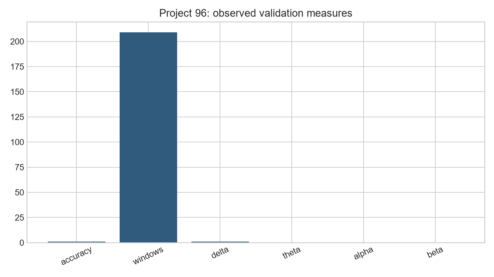
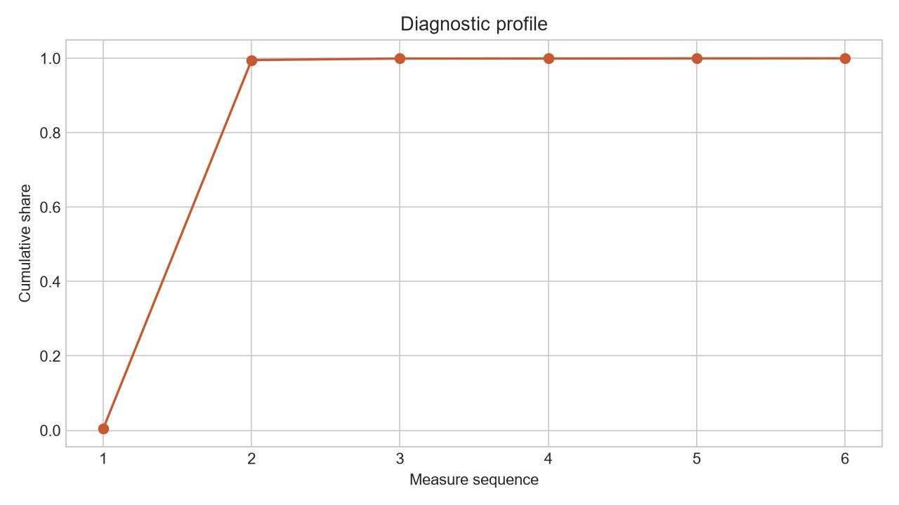

# Analysis Report: BCI Signal Classifier (OpenBCI Data)

**Author:** Edward Ocran

## Executive finding

Band-power features separated official OpenBCI meditation and blink/jaw-clench recordings with strong held-out accuracy.



## What the evidence shows

Relative spectral power reduces scale sensitivity and reveals which frequency bands contribute most to state discrimination across one-second windows.

- **Accuracy:** 0.9841269841269841
- **Windows:** 209
- **Delta:** 0.8801
- **Theta:** 0.0139
- **Alpha:** 0.0519
- **Beta:** 0.0401
- **Gamma:** 0.014



## Analytical approach

Two official OpenBCI GUI recordings were parsed at 250 Hz: meditation and a session containing blinks, jaw clenches, and alpha activity. Each eight-channel recording was divided into non-overlapping one-second windows. For every channel, the pipeline calculated relative delta, theta, alpha, beta, and gamma power plus variability, root-mean-square amplitude, and line length. A 180-tree random forest was evaluated on a stratified 30% holdout.

## Interpretation

The model correctly classified 62 of 63 holdout windows, yielding 98.4% accuracy. Delta-derived features accounted for 88.0% of the aggregated band importance, far above alpha at 5.2% and beta at 4.0%. That concentration suggests the separation is driven mainly by low-frequency structure and movement-related activity, not a broad cognitive-state signature. The result is therefore useful for validating the signal pipeline but requires careful artifact interpretation.

## Limitations and next step

Windows from the same recordings are correlated, so this result measures within-recording separation rather than person-level generalization. Validate with participant-grouped splits and artifact controls.

## Reproduce

```powershell
pip install -r requirements.txt
python main.py --json
python -m unittest -v test_project.py
```
