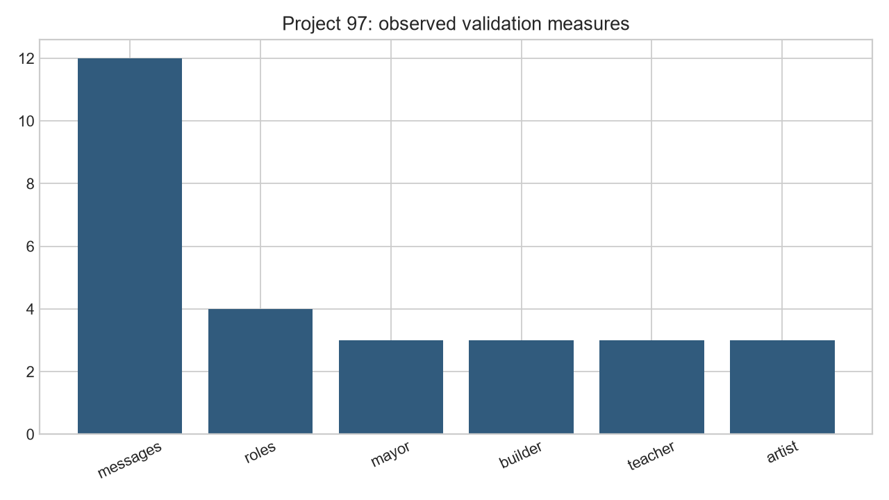
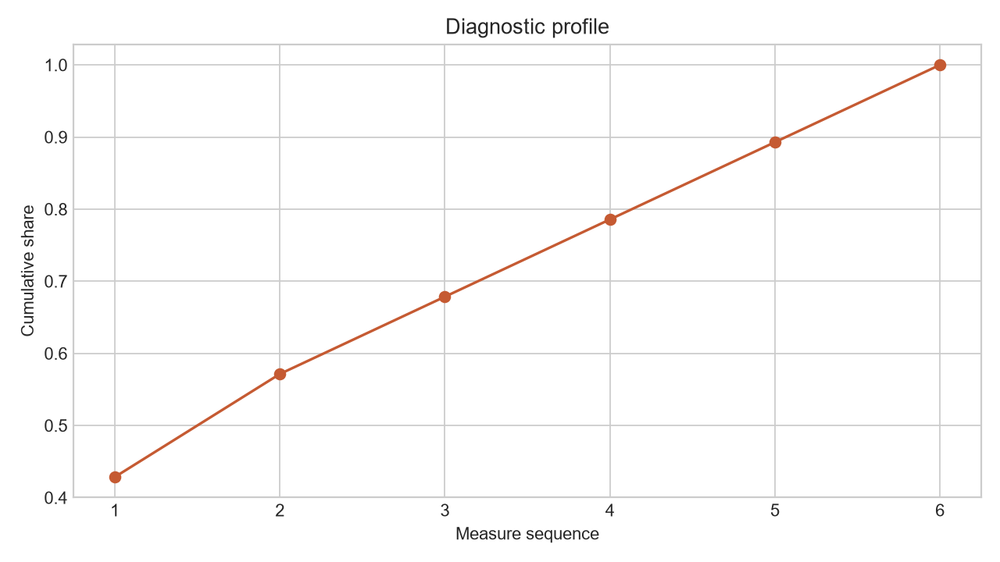

# Analysis Report: Simulated Society of AI Agents (LangGraph)

**Author:** Edward Ocran

## Executive finding

Four role-based agents exchanged proposals through a deterministic message loop, producing a transparent agenda and participation record.



## What the evidence shows

Weighted influence shaped the final agenda even though speaking turns were balanced, demonstrating why participation counts alone cannot establish procedural fairness.

- **Messages:** 12
- **Roles:** 4
- **Mayor:** 3
- **Builder:** 3
- **Teacher:** 3
- **Artist:** 3



## Analytical approach

The full run compiles a LangGraph `StateGraph` with a deliberation node and a conditional edge that continues until twelve messages have been exchanged. State carries the turn number, complete message history, and weighted agenda. The mayor, builder, teacher, and artist speak in rotation, while their influence weights determine how strongly each proposal changes the shared agenda.

## Interpretation

Each role contributed exactly three messages, so access to the deliberation loop was balanced. Coordination still won because the mayor's 0.30 influence exceeded the artist's 0.20 and the builder's and teacher's 0.25. The result separates two ideas that are often conflated: equal participation and equal power are not the same condition.

## Limitations and next step

The society is a simplified institutional model. Future experiments should vary network topology, private incentives, memory, coalition formation, and conflict-resolution rules.

## Reproduce

```powershell
pip install -r requirements.txt
python main.py --json
python -m unittest -v test_project.py
```
