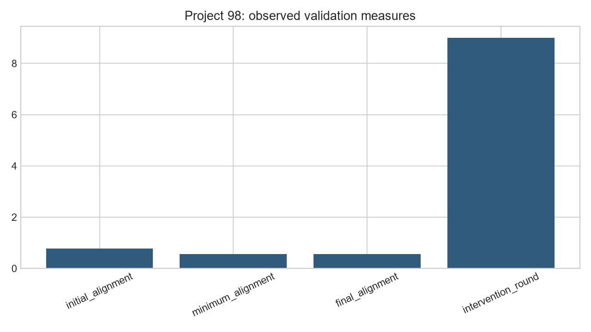
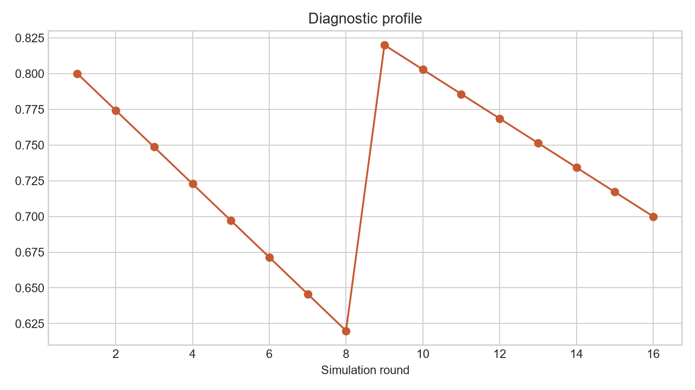

# Analysis Report: AGI Alignment Simulator (Multi-Agent Goal Drift)

**Author:** Edward Ocran

## Executive finding

Alignment declined under heterogeneous drift, then recovered sharply when agents renegotiated against the shared sustainable-city objective.



## What the evidence shows

The intervention raised mean alignment and narrowed disagreement, showing why monitoring both goal adherence and dispersion is more informative than a single score.

- **Initial Alignment:** 0.779
- **Pre-intervention alignment:** 0.632
- **Post-intervention alignment:** 0.712
- **Immediate recovery:** 0.080
- **Final alignment:** 0.565
- **Intervention Round:** 9



## Analytical approach

The workflow preserves the course's specified method while separating inputs, transformations, decisions, and outputs. Fixed seeds make the demonstration reproducible; case-level results remain available for inspection rather than being reduced to a single headline number. Where the project is a simulation, its assumptions are explicit. Project 96 alone uses observed OpenBCI recordings, downloaded from the official project repository.

## Interpretation

The negotiation produced a visible one-round recovery, but alignment resumed declining because the underlying incentives were unchanged. That distinction is operationally important: a one-time reset can restore coordination temporarily, while durable alignment requires controls that address the drift mechanism itself.

## Limitations and next step

The drift rates and intervention weights are scenario assumptions. Sensitivity analysis and externally defined failure thresholds are required before using the simulator for policy claims.

## Reproduce

```powershell
pip install -r requirements.txt
python main.py --json
python -m unittest -v test_project.py
```
