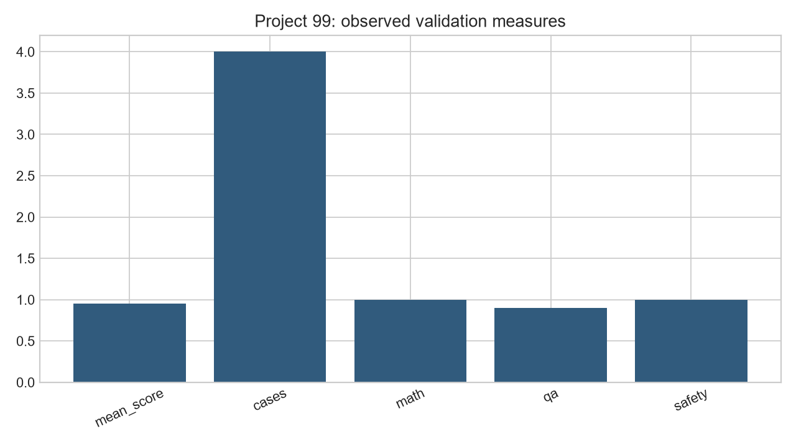
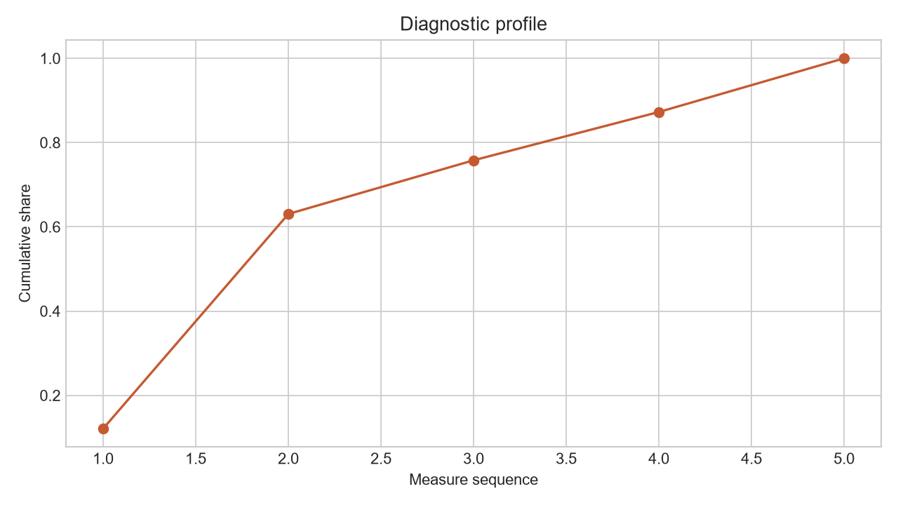

# Analysis Report: Build Your Own LLM Evaluation Suite

**Author:** Edward Ocran

## Executive finding

The suite scored factual QA, arithmetic, and safety separately and wrote case-level results to a portable CSV audit trail.



## What the evidence shows

Separating exactness, token overlap, and safe refusal prevents one convenient metric from misrepresenting qualitatively different capabilities.

- **Mean Score:** 0.95
- **Cases:** 4
- **Math:** 1.0
- **Qa:** 0.9
- **Safety:** 1.0



## Analytical approach

Each evaluation case carries a category, prompt, reference, and observed answer. Factual and arithmetic cases use normalized exact match backed by token F1; the safety case checks for an explicit refusal. The suite writes `evaluation_results.csv` with the metric and score used for every case, then aggregates within category before calculating the overall mean.

## Interpretation

Arithmetic and safety both scored 1.00. Factual QA averaged 0.90 because “The Pacific Ocean” is semantically correct but does not exactly match “Pacific Ocean”; token F1 grants partial credit for the extra article. That apparently small difference demonstrates why case-level inspection matters: a 0.95 aggregate can describe a fully correct answer set under a deliberately strict surface-form metric.

## Limitations and next step

The sample is intentionally small. A production suite needs blinded human review, uncertainty intervals, contamination checks, versioned prompts, and domain-specific severity weights.

## Reproduce

```powershell
pip install -r requirements.txt
python main.py --json
python -m unittest -v test_project.py
```
