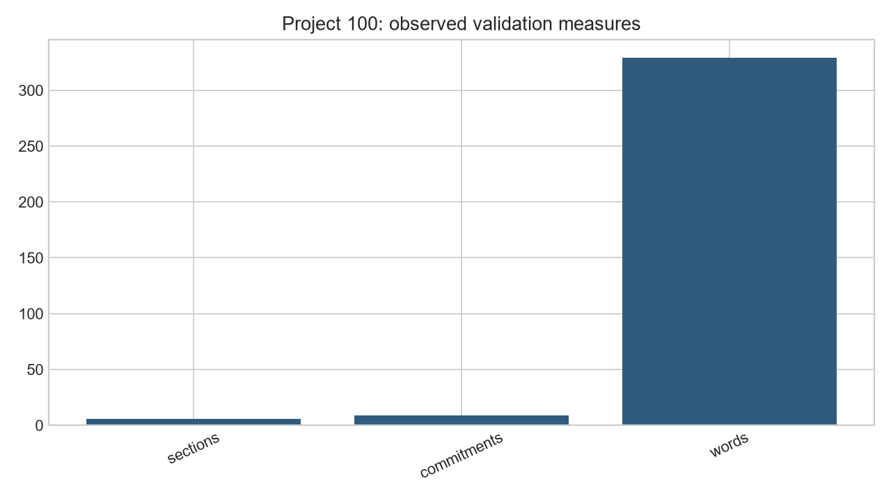
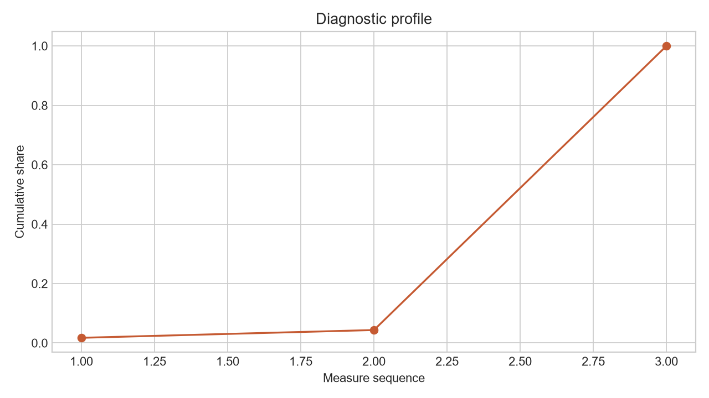

# Analysis Report: Design a Personal AI Manifesto (Reflection Project)

**Author:** Edward Ocran

## Executive finding

The manifesto converts broad principles into specific operating commitments covering evidence, privacy, accountability, inclusion, and continuous learning.



## What the evidence shows

The strongest commitments are testable: disclose uncertainty, preserve human review, document limitations, and refuse work that depends on deception or unsafe handling.

- **Sections:** 6
- **Commitments:** 9
- **Words:** 329



## Analytical approach

The document is evaluated as a working artifact rather than as a sentiment exercise. The parser checks the named sections and numbered commitments, while a human review assesses whether the commitments can guide an actual decision. The manifesto covers philosophy, desired system qualities, required practices, prohibited practices, a future direction, and nine concrete commitments owned by Edward Ocran.

## Interpretation

The document's strongest language is operational: preserve human review, identify accountable decision-makers, document provenance, test uneven performance, and refuse fabricated evidence. The final three commitments establish a one-year review loop—maintain evaluation suites, review quarterly, and carry a recorded improvement into the next project. Those mechanisms make the manifesto capable of changing practice rather than merely describing values.

## Limitations and next step

A manifesto only has value when practice can be audited against it. Review it annually and add concrete examples of decisions that upheld or challenged each commitment.

## Reproduce

```powershell
pip install -r requirements.txt
python main.py --json
python -m unittest -v test_project.py
```
